# FoundrAI Product & Software Specification

**Product:** FoundrAI – AI Product & Startup Studio  
**Tagline:** From Idea to Startup, Powered by AI  

---

## Document Index

| Doc | Purpose |
|-----|---------|
| **01 — Product & Software Specification** (this document) | Master blueprint: product, design, architecture |
| [02 — Developer Implementation Guide](./02-developer-implementation-guide.md) | Chronological build order |
| [03 — API & Database Reference](./03-api-database-reference.md) | REST contracts and schema |

| Part | Sections |
|------|----------|
| Part I — Product Definition | 1–9 |
| Part II — Product Design | 10–15 |
| Part III — Software Design | 16–34 |

---

# Part I — Product Definition

## 1. Executive Summary

### 1.1 Purpose of This Document

This specification is the authoritative blueprint for FoundrAI: what the platform is, who it serves, what it must do, and how it is designed at the product and software levels. Engineering, product, and design teams should treat this document as the single source of truth for scope, architecture, and acceptance criteria during build-out.

### 1.2 Product Definition

FoundrAI is an AI-powered SaaS platform that helps entrepreneurs transform startup ideas into validated business plans, product roadmaps, technical architectures, financial strategies, marketing plans, and investor-ready documentation. The platform operates as an **AI Operating System for Startup Creation**—not a conversational chatbot.

Users do not interact with a generic assistant. They manage **startup projects** inside a structured workspace where every AI-generated artifact is persisted, versioned, cross-linked, and reused across subsequent workflows. The system orchestrates multiple specialized AI agents, retrieval-augmented generation (RAG), and persistent project memory to produce **structured, actionable outputs** rather than ephemeral chat responses.

### 1.3 Core Problem Statement

Early-stage founders and product teams face a fragmented toolchain when moving from idea to execution:

| Pain Point | Current State | FoundrAI Response |
|------------|---------------|-------------------|
| Unstructured ideation | Notes scattered across docs, chats, and whiteboards | Centralized project workspace with typed artifacts |
| Generic AI advice | Chatbots produce one-off answers with no project continuity | Persistent memory and agent workflows tied to project context |
| Missing domain depth | Single-model prompts lack business, technical, and financial rigor | Multi-agent specialization with orchestrated handoffs |
| Documentation drift | Plans become stale as the idea evolves | Versioned artifacts linked to project state and memory |
| Investor readiness gap | Manual assembly of pitch decks, financials, and narratives | Structured export pipelines from validated project data |

FoundrAI addresses these gaps by treating startup creation as a **managed workflow** with durable outputs, not as a sequence of isolated Q&A sessions.

### 1.4 Solution Overview

FoundrAI combines four architectural pillars:

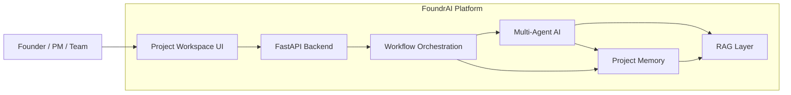

| Pillar | Role |
|--------|------|
| **Project Workspace** | Next.js application where users create projects, trigger workflows, review artifacts, and track progress |
| **Workflow Orchestration** | LangGraph-based pipelines that sequence agent tasks, enforce dependencies, and handle retries |
| **Multi-Agent AI** | Domain-specific agents (e.g., market research, product strategy, architecture, finance) producing typed outputs |
| **Persistent Project Memory + RAG** | Embeddings and vector retrieval over project artifacts and external knowledge to ground agent reasoning |

Every user action and AI response contributes to **project knowledge** that informs future agent runs within the same project.

### 1.5 Key Differentiators

FoundrAI is intentionally differentiated from general-purpose AI tools:

1. **Project-centric, not session-centric.** Context survives across sessions, modules, and agents.
2. **Structured outputs over free text.** Agents emit schema-validated artifacts (plans, roadmaps, models) suitable for downstream use and export.
3. **Orchestrated multi-agent workflows.** Complex startup tasks decompose into agent steps with explicit inputs, outputs, and acceptance gates.
4. **RAG-grounded reasoning.** Agents retrieve from project history and curated knowledge bases before generating new content.
5. **End-to-end startup lifecycle coverage.** A single platform spans validation, product, engineering, finance, marketing, and investor materials.

### 1.6 Technology Summary

FoundrAI is built as a modern full-stack AI SaaS application:

| Layer | Stack |
|-------|-------|
| Frontend | Next.js, React, TypeScript, Tailwind CSS, shadcn/ui, Framer Motion, TanStack Query |
| Backend | Python, FastAPI |
| Database | PostgreSQL, SQLAlchemy, Alembic |
| Authentication | JWT |
| AI Orchestration | LangGraph, LangChain |
| Models | Qwen 3 8B (primary), Llama (future), via Ollama |
| Embeddings | Sentence Transformers — `BAAI/bge-base-en-v1.5` |
| Vector Store | FAISS |
| Deployment | Docker; AWS (future) |

Detailed architecture is specified in Part III (Sections 16–30). Implementation sequencing is covered in the Developer Implementation Guide.

### 1.7 Product Scope at a Glance

**In scope (v1):**

- User authentication and project management
- Multi-module startup workspace (validation, product, architecture, finance, marketing, investor docs)
- LangGraph-orchestrated agent workflows per module
- RAG over project artifacts and module-specific knowledge
- Persistent project memory with embedding-backed retrieval
- Structured artifact storage, versioning, and review in the UI
- Docker-based local and containerized deployment

**Explicitly out of scope (v1):**

- Real-time collaboration (multi-user editing)
- Payment and subscription billing
- Third-party integrations (Notion, Google Docs, CRM)
- Hosted cloud LLM APIs as default inference (Ollama-local first)
- Mobile-native applications

Full scope boundaries are defined in Section 7.

### 1.8 Target Outcomes

Upon successful implementation, FoundrAI should enable a user to:

1. Create a startup project from a raw idea or brief.
2. Run guided AI workflows that produce validated, interlinked business and product artifacts.
3. Re-run or extend workflows as the project evolves without losing prior context.
4. Export investor-ready documentation derived from structured project data.
5. Trust that AI outputs are traceable to project memory and retrieval sources.

Success metrics and KPIs are defined in Section 33.

### 1.9 Assumptions

The following assumptions underpin this specification and should be validated during implementation planning:

| ID | Assumption |
|----|------------|
| A-1 | Primary users are technical or semi-technical founders and product managers comfortable with SaaS workflows |
| A-2 | Initial inference runs locally or on infrastructure where Ollama can serve Qwen 3 8B with acceptable latency |
| A-3 | A single PostgreSQL instance is sufficient for v1 tenancy and artifact volume |
| A-4 | FAISS indexes are co-located with the backend service; distributed vector search is deferred |
| A-5 | English is the sole supported language for v1 prompts, UI, and artifacts |
| A-6 | One user owns a project in v1; team permissions are a future enhancement |

### 1.10 Dependencies

| Dependency | Impact |
|------------|--------|
| Ollama + Qwen 3 8B availability | Blocks all agent workflow execution |
| PostgreSQL | Blocks auth, projects, artifacts, and metadata persistence |
| Sentence Transformers embedding model | Blocks RAG indexing and retrieval |
| LangGraph / LangChain stability | Blocks workflow orchestration design |
| Docker runtime | Blocks standardized deployment and onboarding |

### 1.11 Document Map

Subsequent sections expand on this summary without repeating it:

| Section | Content |
|---------|---------|
| 2 | Vision, mission, and measurable product goals |
| 3–4 | Business problem depth and market opportunity |
| 5–6 | Target users and personas |
| 7–9 | Scope, functional requirements, non-functional requirements |
| 10–15 | User journeys, workflows, module/agent/screen specs, AI workflows |
| 16–34 | System, frontend, backend, AI, RAG, memory, database, API, security, deployment, risks, roadmap, metrics, glossary |

---

## 2. Vision, Mission, and Product Goals

### 2.1 Vision

FoundrAI becomes the default operating system for turning ideas into fundable, buildable startups—where AI agents, structured workflows, and persistent project memory replace fragmented documents and disposable chat sessions.

### 2.2 Mission

Deliver a project-centric platform that guides founders from initial idea through validated plans, product and technical strategy, financial and marketing models, and investor-ready materials— with every output stored as reusable, retrievable project knowledge.

### 2.3 Strategic Product Goals

| ID | Goal | Horizon | Measure |
|----|------|---------|---------|
| PG-1 | End-to-end module coverage for v1 startup lifecycle | v1 launch | 8 modules shippable with dependency gates |
| PG-2 | Structured artifact quality | v1 | ≥85% schema-valid agent outputs on eval set |
| PG-3 | Project continuity | v1 | 100% of agent runs retrieve project memory before generation |
| PG-4 | Time-to-first-artifact | v1 | <15 min from signup to first completed validation report |
| PG-5 | Investor export readiness | v1 | Export pack from ≥5 artifact types in one action |
| PG-6 | Inference sovereignty | v1 | Default stack runs on Ollama without external LLM API |
| PG-7 | Production deployability | v1 | Full stack via Docker Compose with documented env |

### 2.4 Design Principles

1. **Artifacts over messages.** User value is measured in persisted outputs, not chat length.
2. **Explicit dependencies.** Modules unlock in a defined order; the system enforces prerequisites.
3. **Ground before generate.** RAG retrieval is mandatory in standard agent pipelines (Section 15).
4. **Human in the loop.** Users review, edit, and re-run workflows; AI proposes, humans approve.
5. **Traceability.** Workflow runs, steps, and agent executions are auditable (Document 3).

### 2.5 Non-Goals (v1)

Billing, multi-tenant teams, third-party sync, and cloud-managed LLM defaults are out of scope per Section 1.7.

---

## 3. Business Problem

### 3.1 Problem Context

Founders at pre-seed and seed stage must simultaneously validate markets, define products, estimate financials, and narrate a coherent story to investors—often without dedicated staff in each discipline. General productivity and AI chat tools optimize for speed of text, not coherence of a **single evolving venture**.

### 3.2 Root Causes

| Cause | Effect |
|-------|--------|
| Tool fragmentation | Context lost between Notion, spreadsheets, slides, and ChatGPT |
| Session-based AI | No memory of prior decisions; contradictory advice across sessions |
| Unstructured outputs | Manual rework to fit pitch decks, models, or dev backlogs |
| No workflow semantics | Users must know *what to ask next*; tools do not guide sequence |
| Weak validation | Ideas proceed without explicit validation artifacts |

### 3.3 FoundrAI Thesis

Startup creation is a **workflow problem** with **knowledge accumulation**, solvable by an AI OS that: (1) scopes work into modules, (2) runs specialized agents under orchestration, (3) persists structured artifacts, and (4) retrieves prior work for every new step.

---

## 4. Market Opportunity

### 4.1 Market Segments

| Segment | Description | FoundrAI Fit |
|---------|-------------|--------------|
| Solo founders | First-time entrepreneurs with technical or domain skill | Primary v1 persona |
| Indie hackers / builders | Shipping SaaS or apps with business planning gap | High fit |
| Accelerator cohorts | Structured program needing consistent deliverables | Future B2B |
| Product managers (internal ventures) | Corporate innovation teams | Future persona |
| Consultants / agencies | White-label startup planning | Future channel |

### 4.2 Category Positioning

FoundrAI sits at the intersection of **startup planning software**, **multi-agent AI platforms**, and **business intelligence workspaces**. It competes on depth of orchestration and artifact structure, not on raw chat capability.

### 4.3 Opportunity Assumptions

| ID | Assumption |
|----|------------|
| M-1 | Demand for AI planning tools will favor vertical, outcome-oriented products over horizontal chat |
| M-2 | Founders will accept local/cloud-hosted open models for sensitive early-stage ideas |
| M-3 | Structured exports (investor pack) drive willingness to complete full module path |

---

## 5. Target Users

### 5.1 Primary Users (v1)

Users who create and own projects, run module workflows, edit artifacts, and export investor materials. They are comfortable with web SaaS, can interpret business and product documents, and tolerate async AI job latency (minutes, not seconds).

### 5.2 Secondary Users (Future)

Team collaborators, accelerator mentors (read-only), and agency operators managing client projects. Not supported in v1 (Assumption A-6).

### 5.3 User Needs Summary

| Need | FoundrAI Capability |
|------|---------------------|
| Guided path from idea to plan | Module sequence + dependency gates |
| Trustworthy continuity | Project memory + RAG |
| Editable deliverables | Artifact versioning + user PATCH |
| Progress visibility | Module status + workflow run timeline |
| Fundraising support | Investor module + export |

---

## 6. User Personas

### 6.1 Persona: Alex — Technical Solo Founder

| Attribute | Detail |
|-----------|--------|
| Role | Software engineer starting first B2B SaaS |
| Goals | Validate idea, define MVP roadmap, rough financials for angels |
| Pain | Strong on build, weak on GTM and finance; ChatGPT answers feel generic |
| Behavior | Wants checklists and structured outputs to share with a co-founder |
| Success | Completes validation → product → architecture → investor outline in one project |

### 6.2 Persona: Jordan — Product Manager Turned Founder

| Attribute | Detail |
|-----------|--------|
| Role | Ex-FAANG PM exploring a consumer health startup |
| Goals | Market sizing, positioning, marketing plan, pitch narrative |
| Pain | Too many slide templates; no single source of truth |
| Behavior | Iterates frequently; re-runs modules after user research |
| Success | Re-runs market research without losing business model edits |

### 6.3 Persona: Sam — Domain Expert Non-Technical Founder

| Attribute | Detail |
|-----------|--------|
| Role | Industry operator (logistics) with operational insight, limited tech vocabulary |
| Goals | Understand technical architecture options and cost implications |
| Pain | Overwhelmed by architecture jargon from generic AI |
| Behavior | Reads markdown summaries; relies on module order for guidance |
| Success | Produces architecture and financial artifacts understandable to advisors |

---

## 7. Product Scope

### 7.1 In Scope (v1)

Reference Section 1.7 for summary. Detailed module list:

| Module Key | Deliverable Artifact |
|------------|---------------------|
| `idea_validation` | `validation_report` |
| `market_research` | `market_analysis` |
| `business_model` | `business_model_canvas` |
| `product_strategy` | `product_roadmap` |
| `technical_architecture` | `architecture_doc` |
| `financial_planning` | `financial_model` |
| `marketing_strategy` | `marketing_plan` |
| `investor_documentation` | `investor_deck_outline` |

Platform capabilities: auth, project CRUD, workflow trigger/status, artifact CRUD/versioning, memory search (internal + debug), SSE progress, investor export, Docker deployment.

### 7.2 Out of Scope (v1)

Collaboration, billing, external integrations, default OpenAI/Anthropic APIs, native mobile, PDF export (markdown export only), multi-language UI, custom user-defined agents, public API keys for third parties.

### 7.3 Module Dependency Matrix

| Module | Required Prior Artifacts |
|--------|--------------------------|
| Idea Validation | Project `idea_brief` only |
| Market Research | `validation_report` |
| Business Model | `validation_report`, `market_analysis` |
| Product Strategy | `business_model_canvas` |
| Technical Architecture | `product_roadmap` |
| Financial Planning | `business_model_canvas`, `product_roadmap` |
| Marketing Strategy | `business_model_canvas`, `product_roadmap` |
| Investor Documentation | All prior artifact types (recommended minimum: validation, business model, financial, product) |

Enforcement: API returns `409 MODULE_DEPENDENCY_NOT_MET` (Document 3).

### 7.4 Future Scope

Team workspaces, role-based access, cloud LLM routing, Llama model support, PDF/PPTX export, accelerator admin dashboards, curated industry knowledge packs, workflow customization.

---

## 8. Functional Requirements

Requirements use IDs `{FR}-{DOMAIN}-{NNN}`. **Must** = mandatory for v1.

### 8.1 Authentication & Account

| ID | Requirement | Priority |
|----|-------------|----------|
| FR-AUTH-001 | User MUST register with email, password, full name | Must |
| FR-AUTH-002 | User MUST login and receive JWT access + refresh token | Must |
| FR-AUTH-003 | User MUST refresh access token without re-entering password | Must |
| FR-AUTH-004 | User MUST logout and revoke refresh token | Must |
| FR-AUTH-005 | User MUST view own profile via authenticated endpoint | Must |

### 8.2 Projects

| ID | Requirement | Priority |
|----|-------------|----------|
| FR-PRJ-001 | User MUST create project with name and idea brief | Must |
| FR-PRJ-002 | System MUST seed eight module rows on project creation | Must |
| FR-PRJ-003 | User MUST list, view, update, soft-delete own projects | Must |
| FR-PRJ-004 | System MUST index idea brief into project memory on create/update | Must |
| FR-PRJ-005 | Idea Validation module MUST be `available` on create; others `locked` until dependencies met | Must |

### 8.3 Modules & Workflows

| ID | Requirement | Priority |
|----|-------------|----------|
| FR-WF-001 | User MUST trigger workflow run per module_key | Must |
| FR-WF-002 | System MUST reject run when module dependencies not satisfied | Must |
| FR-WF-003 | System MUST prevent concurrent runs for same module (pending/running) | Must |
| FR-WF-004 | System MUST persist workflow_run, steps, agent_executions | Must |
| FR-WF-005 | User MUST view run status and step timeline | Must |
| FR-WF-006 | User MUST cancel pending/running workflow | Should |
| FR-WF-007 | System MUST emit SSE events for step and run status | Must |
| FR-WF-008 | On success, system MUST set module status `completed` and unlock dependent modules | Must |

### 8.4 Artifacts

| ID | Requirement | Priority |
|----|-------------|----------|
| FR-ART-001 | Each successful module run MUST upsert typed artifact | Must |
| FR-ART-002 | System MUST create artifact_version on every AI or user change | Must |
| FR-ART-003 | User MUST view artifact JSON and markdown rendering | Must |
| FR-ART-004 | User MUST edit artifact and trigger re-index of memory | Must |
| FR-ART-005 | User MUST list version history | Must |

### 8.5 AI & Memory

| ID | Requirement | Priority |
|----|-------------|----------|
| FR-AI-001 | Agent pipeline MUST retrieve top-k memory chunks before LLM call | Must |
| FR-AI-002 | Agent output MUST validate against artifact JSON schema | Must |
| FR-AI-003 | Failed validation MUST retry up to 2 times then fail run | Must |
| FR-AI-004 | System MUST log model name, latency, and execution status | Must |
| FR-AI-005 | Memory search endpoint MUST return scored chunks for project | Must |

### 8.6 Export

| ID | Requirement | Priority |
|----|-------------|----------|
| FR-EXP-001 | User MUST generate investor pack markdown from artifacts | Must |
| FR-EXP-002 | Export MUST fail clearly when minimum artifacts missing | Must |

### 8.7 Admin & Operations

| ID | Requirement | Priority |
|----|-------------|----------|
| FR-OPS-001 | Health endpoints MUST expose liveness and readiness | Must |
| FR-OPS-002 | Readiness MUST verify database and Ollama model | Must |
| FR-OPS-003 | System MUST write audit log for project create, workflow trigger, export | Should |

---

## 9. Non-Functional Requirements

### 9.1 Performance

| ID | Requirement | Target |
|----|-------------|--------|
| NFR-PERF-001 | API p95 latency (non-AI endpoints) | < 300 ms |
| NFR-PERF-002 | Workflow trigger acknowledgment | < 500 ms (202 returned before graph completes) |
| NFR-PERF-003 | Single module workflow completion | < 10 min p95 on reference hardware (Section 28) |
| NFR-PERF-004 | Memory search | < 1 s p95 for top_k=8 |

### 9.2 Availability & Reliability

| ID | Requirement | Target |
|----|-------------|--------|
| NFR-AVAIL-001 | Local Docker Compose stack starts cleanly from clean clone | 100% documented path |
| NFR-REL-001 | Workflow failure MUST leave run in `failed` with error_code | Must |
| NFR-REL-002 | Partial writes MUST NOT leave orphan artifacts without version | Must |

### 9.3 Security

| ID | Requirement |
|----|-------------|
| NFR-SEC-001 | Passwords MUST be bcrypt-hashed; never logged |
| NFR-SEC-002 | JWT secret MUST be environment-provided |
| NFR-SEC-003 | All project routes MUST enforce owner authorization |
| NFR-SEC-004 | CORS MUST restrict to configured frontend origin in non-dev |

### 9.4 Scalability (Future)

| ID | Requirement |
|----|-------------|
| NFR-SCALE-001 | Stateless API design to allow horizontal replication |
| NFR-SCALE-002 | FAISS per-project indexes swappable for centralized vector DB |
| NFR-SCALE-003 | Workflow execution movable to queue workers |

### 9.5 Maintainability

| ID | Requirement |
|----|-------------|
| NFR-MAINT-001 | Database migrations via Alembic only |
| NFR-MAINT-002 | API contracts documented in Document 3 |
| NFR-MAINT-003 | Agent prompts versioned in repository paths per Implementation Guide §14 |

### 9.6 Observability

| ID | Requirement |
|----|-------------|
| NFR-OBS-001 | Structured JSON logs for requests and workflow events |
| NFR-OBS-002 | Correlation id per workflow_run across steps |

---

# Part II — Product Design

## 10. User Journey

### 10.1 Journey Overview

The v1 journey spans discovery through export: account creation, first project, sequential module completion with review/edit loops, and investor pack generation.

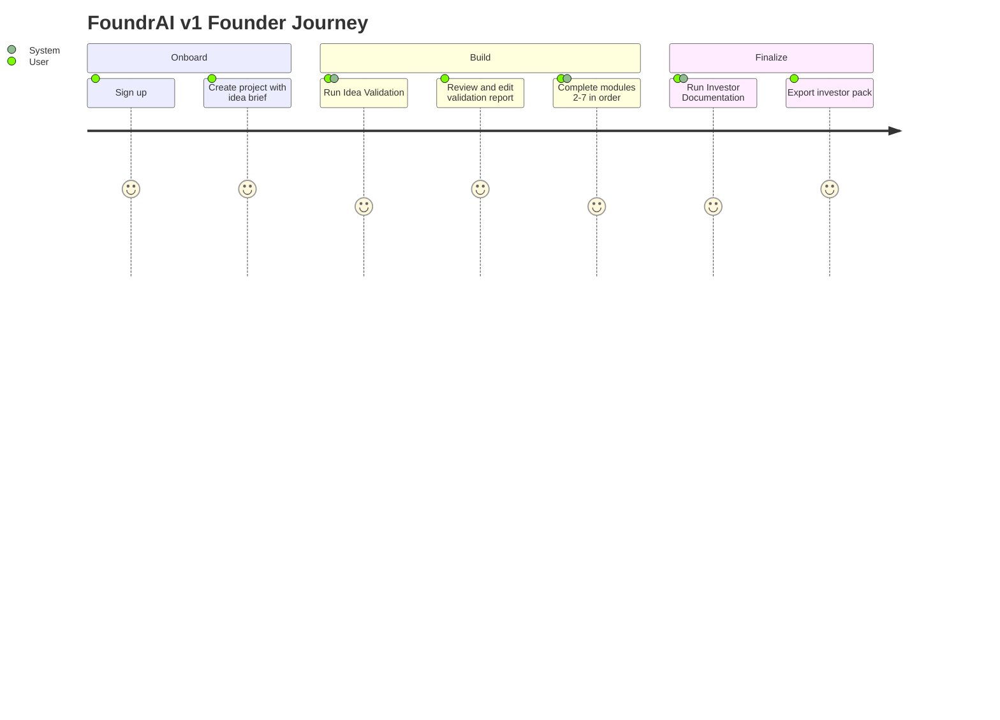

### 10.2 Journey Stages

| Stage | User Actions | System Responses |
|-------|--------------|------------------|
| Onboard | Register, login | Auth tokens, empty dashboard |
| Initiate | Create project | Modules seeded, brief indexed |
| Execute | Trigger module workflow | Async run, SSE updates, artifact persisted |
| Refine | Edit artifact, re-run module | New version, memory re-indexed |
| Complete | Export pack | Markdown bundle download |

### 10.3 Edge Paths

| Scenario | Behavior |
|----------|----------|
| User skips ahead | Module remains locked or API rejects with dependency error |
| Workflow fails | Module `failed`, user sees error, can retry run |
| User edits idea brief | Memory re-chunked; downstream modules not auto-invalid (user re-runs manually) |

Screens for each stage: Section 14.

---

## 11. Product Workflow

### 11.1 Project Lifecycle State Machine

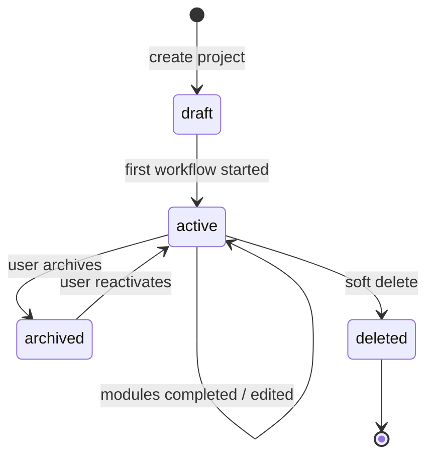

### 11.2 Module Status Workflow

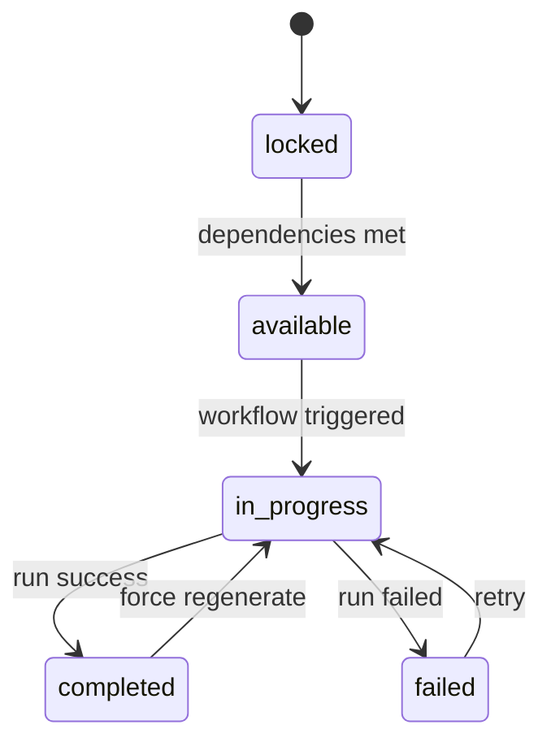

### 11.3 Cross-Module Data Flow

Project brief and artifacts flow forward only through memory retrieval and explicit dependency checks—not implicit auto-sync. Downstream agents **read** upstream artifacts via RAG and structured artifact fetch in graph `load_context` node.

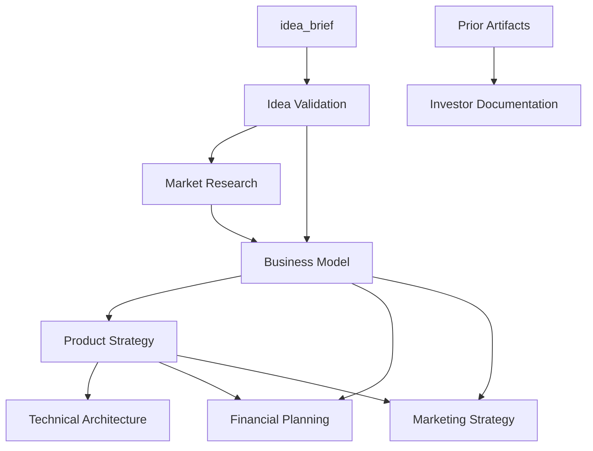

---

## 12. Module Specifications

Each module follows a common pattern: **Purpose**, **Inputs**, **Outputs**, **Dependencies**, **Workflow**, **Acceptance Criteria**.

### 12.1 Idea Validation

| Field | Detail |
|-------|--------|
| Purpose | Stress-test idea clarity, problem-solution fit, and initial feasibility |
| Inputs | `idea_brief`, optional industry tag |
| Outputs | `validation_report` (JSON schema: problem, solution, target customer, risks, score) |
| Dependencies | None |
| Workflow | Standard pipeline (Section 15); agent `idea_validator` |
| Acceptance Criteria | Report includes risk list ≥3 items; validation score 0–100; module marks completed |

### 12.2 Market Research

| Field | Detail |
|-------|--------|
| Purpose | Define market size, segments, trends, and opportunity |
| Inputs | Validation report, idea brief via RAG |
| Outputs | `market_analysis` (TAM/SAM/SOM estimates, segments, competitors summary) |
| Dependencies | `validation_report` |
| Workflow | Agent `market_researcher` |
| Acceptance Criteria | At least 3 competitor entries; TAM/SAM/SOM fields populated |

### 12.3 Business Model

| Field | Detail |
|-------|--------|
| Purpose | Articulate revenue model, value proposition, channels, cost structure |
| Inputs | Validation + market artifacts |
| Outputs | `business_model_canvas` (nine-block canvas structure) |
| Dependencies | `validation_report`, `market_analysis` |
| Workflow | Agent `business_modeler` |
| Acceptance Criteria | All nine canvas blocks non-empty |

### 12.4 Product Strategy

| Field | Detail |
|-------|--------|
| Purpose | Define MVP scope, phases, and feature roadmap |
| Inputs | Business model canvas |
| Outputs | `product_roadmap` (phases, features, priorities, metrics) |
| Dependencies | `business_model_canvas` |
| Workflow | Agent `product_strategist` |
| Acceptance Criteria | ≥2 roadmap phases; each phase has ≥3 features |

### 12.5 Technical Architecture

| Field | Detail |
|-------|--------|
| Purpose | Propose system architecture aligned with product scope |
| Inputs | Product roadmap |
| Outputs | `architecture_doc` (components, stack, data flows, non-functional notes) |
| Dependencies | `product_roadmap` |
| Workflow | Agent `technical_architect` |
| Acceptance Criteria | Component diagram description; stack recommendations; security section |

### 12.6 Financial Planning

| Field | Detail |
|-------|--------|
| Purpose | Build initial financial outlook and unit economics |
| Inputs | Business model + product roadmap |
| Outputs | `financial_model` (revenue drivers, cost buckets, 12-month projection table) |
| Dependencies | `business_model_canvas`, `product_roadmap` |
| Workflow | Agent `financial_analyst` |
| Acceptance Criteria | 12-month projection; assumptions list ≥5 items |

### 12.7 Marketing Strategy

| Field | Detail |
|-------|--------|
| Purpose | Define ICP, positioning, channels, and launch plan |
| Inputs | Business model + product roadmap |
| Outputs | `marketing_plan` (ICP, messaging, channels, calendar) |
| Dependencies | `business_model_canvas`, `product_roadmap` |
| Workflow | Agent `marketing_strategist` |
| Acceptance Criteria | ≥3 channels; launch checklist ≥5 items |

### 12.8 Investor Documentation

| Field | Detail |
|-------|--------|
| Purpose | Synthesize narrative and slide outline for fundraising |
| Inputs | All prior artifacts via RAG + structured load |
| Outputs | `investor_deck_outline` (slide list with key bullets per slide) |
| Dependencies | All prior modules (export minimum enforced separately) |
| Workflow | Agent `investor_writer` |
| Acceptance Criteria | ≥10 slides outlined; includes problem, market, product, traction plan, ask |

### 12.9 Artifact Content Schemas

Canonical field-level definitions for `content_json` live in **Document 3 §18**. Each module’s primary artifact MUST conform to its schema before persistence. The following table maps modules to root object keys and required top-level sections.

| `artifact_type` | Required top-level keys | Min array lengths (validation) |
|-----------------|-------------------------|--------------------------------|
| `validation_report` | `problem`, `solution`, `target_customer`, `risks`, `validation_score`, `summary` | `risks` ≥ 3 |
| `market_analysis` | `tam`, `sam`, `som`, `segments`, `competitors`, `trends`, `summary` | `competitors` ≥ 3 |
| `business_model_canvas` | `value_proposition`, `customer_segments`, `channels`, `customer_relationships`, `revenue_streams`, `key_resources`, `key_activities`, `key_partnerships`, `cost_structure` | All blocks non-empty string or list |
| `product_roadmap` | `vision`, `phases`, `success_metrics`, `summary` | `phases` ≥ 2; each phase `features` ≥ 3 |
| `architecture_doc` | `overview`, `components`, `data_flows`, `recommended_stack`, `security`, `scalability`, `summary` | `components` ≥ 3 |
| `financial_model` | `assumptions`, `revenue_drivers`, `cost_buckets`, `monthly_projections`, `unit_economics`, `summary` | `assumptions` ≥ 5; `monthly_projections` length 12 |
| `marketing_plan` | `icp`, `positioning`, `messaging`, `channels`, `launch_checklist`, `timeline`, `summary` | `channels` ≥ 3; `launch_checklist` ≥ 5 |
| `investor_deck_outline` | `slides`, `narrative_arc`, `summary` | `slides` ≥ 10 |

**Design decision:** Schemas are enforced in `ai/schemas/` (Pydantic) and mirrored in Document 3 for API consumers. User edits via PATCH MUST re-validate against the same schema.

---

## 13. AI Agent Specifications

Agents are LangGraph nodes invoking Ollama (`qwen3:8b` v1). Orchestrator agent routes only; it does not produce artifacts.

### 13.1 Agent Catalog

| Agent ID | Module | Output Artifact | Tools |
|----------|--------|-----------------|-------|
| `idea_validator` | Idea Validation | `validation_report` | memory_search |
| `market_researcher` | Market Research | `market_analysis` | memory_search |
| `business_modeler` | Business Model | `business_model_canvas` | memory_search |
| `product_strategist` | Product Strategy | `product_roadmap` | memory_search |
| `technical_architect` | Technical Architecture | `architecture_doc` | memory_search |
| `financial_analyst` | Financial Planning | `financial_model` | memory_search, calculator |
| `marketing_strategist` | Marketing Strategy | `marketing_plan` | memory_search |
| `investor_writer` | Investor Documentation | `investor_deck_outline` | memory_search |
| `orchestrator` | — | — | route_module (internal) |

### 13.2 Common Agent Contract

| Aspect | Specification |
|--------|---------------|
| Inputs | `WorkflowState`: project_id, module_key, retrieved_context[], input_snapshot |
| Outputs | JSON matching `ai/schemas/{artifact_type}.py` |
| Prompt strategy | System: role + output schema; User: brief + retrieved chunks + prior artifact summaries |
| Validation | Pydantic parse; on failure retry with repair instruction (max 2) |
| Persistence | Backend callback creates artifact + version + memory chunks |
| Dependencies | Ollama runtime, RAG index, project artifacts per module gate |

### 13.3 Agent-Specific Notes

**`financial_analyst`:** Calculator tool allowed for simple arithmetic on projections; LLM must not invent inconsistent totals when calculator used.

**`investor_writer`:** Must cite synthesis from existing artifacts; prohibited from introducing new market numbers not present in source artifacts unless marked as hypothetical in output.

**`orchestrator`:** Used for future multi-module flows; v1 graphs are single-module but orchestrator stub supports routing consistency.

### 13.4 Agent Specification Template

Every domain agent MUST document the following. Sections 13.5–13.12 apply this template; Section 13.13 covers the orchestrator.

| Field | Description |
|-------|-------------|
| Agent Name | Stable `agent_id` and display name |
| Purpose | Business outcome of the agent |
| Responsibilities | Bounded tasks the agent performs and does not perform |
| Input | Structured inputs from WorkflowState and API |
| Output | `artifact_type` and schema reference (Document 3 §18) |
| Prompt Templates | System, developer, user, validation, repair, reflection, retry (Section 13.14) |
| Memory Access | Which memory tiers and retrieval filters |
| Knowledge Sources | Curated paths under `data/knowledge/` |
| Failure Conditions | When the agent or graph must fail or escalate |
| Dependencies | Upstream artifacts, services, models |
| Fallback Strategy | Degraded behavior before human review |
| Evaluation Metrics | Automated and human eval criteria (Section 13.15) |
| Model Configuration | Per-agent inference parameters (Section 19.5) |

See Sections 13.5–13.13 for full per-agent specifications.

### 13.5 Idea Validation Agent (`idea_validator`)

| Field | Specification |
|-------|---------------|
| **Purpose** | Evaluate whether an idea is clearly defined, addresses a real problem, and is worth pursuing before deeper research spend |
| **Responsibilities** | Clarify problem/solution fit; identify target customer hypothesis; surface risks and assumptions; produce validation score — **does not** perform market sizing or financial modeling |
| **Input** | `idea_brief` (required), `industry` (optional), `project.name`, `input_snapshot.options` |
| **Output** | `validation_report` (Document 3 §18.1) |
| **Memory Access** | Project memory: `idea_brief` chunks; no prior artifacts required |
| **Knowledge Sources** | `data/knowledge/startup/`, `data/knowledge/templates/validation/` |
| **Prompt Templates** | `ai/prompts/agents/idea_validator/` — see Section 13.14 |
| **Failure Conditions** | Brief under 50 chars (API rejects before agent); LLM timeout; schema invalid after 2 repair retries; empty risks array |
| **Dependencies** | Ollama, project memory index, knowledge seed |
| **Fallback Strategy** | 1) Retry with reduced context (brief only); 2) Repair prompt; 3) Fail with `INSUFFICIENT_INFORMATION` and UI prompt to expand brief |
| **Evaluation Metrics** | JSON validity 100%; risks ≥3; score 0–100; faithfulness to brief (eval judge ≥4/5); latency p95 under 120s |

### 13.6 Market Research Agent (`market_researcher`)

| Field | Specification |
|-------|---------------|
| **Purpose** | Produce market landscape, segments, competitors, and TAM/SAM/SOM grounded in project context |
| **Responsibilities** | Segment market; summarize competitors; identify trends — **does not** set pricing or financial projections |
| **Input** | `validation_report`, `idea_brief`, RAG chunks |
| **Output** | `market_analysis` (Document 3 §18.2) |
| **Memory Access** | Project memory; prioritize `validation_report` |
| **Knowledge Sources** | `data/knowledge/marketing/`, `data/knowledge/startup/market_sizing/`, `data/knowledge/case_studies/` |
| **Failure Conditions** | Missing validation artifact; fewer than 3 competitors; TAM/SAM/SOM missing units |
| **Dependencies** | `validation_report` |
| **Fallback Strategy** | Reduce retrieval to validation only; fail with schema error if still invalid |
| **Evaluation Metrics** | TAM/SAM/SOM complete; competitor count; retrieval relevance ≥0.7 on eval set |

### 13.7 Business Model Agent (`business_modeler`)

| Field | Specification |
|-------|---------------|
| **Purpose** | Translate validated idea and market context into a business model canvas |
| **Responsibilities** | Fill nine canvas blocks coherently — **does not** define product features or tech stack |
| **Input** | `validation_report`, `market_analysis`, RAG top-k |
| **Output** | `business_model_canvas` (Document 3 §18.3) |
| **Memory Access** | Full project memory; boost validation and market chunks |
| **Knowledge Sources** | `data/knowledge/startup/business_model/`, `data/knowledge/templates/canvas/` |
| **Failure Conditions** | Empty canvas block; revenue/value-prop contradiction in validation prompt |
| **Dependencies** | `validation_report`, `market_analysis` |
| **Fallback Strategy** | Reflection node (Section 20.6); one retry; else fail |
| **Evaluation Metrics** | All blocks non-empty; cross-block consistency ≥80% on eval |

### 13.8 Product Strategist Agent (`product_strategist`)

| Field | Specification |
|-------|---------------|
| **Purpose** | Define MVP scope, phased roadmap, and success metrics |
| **Input** | `business_model_canvas`, RAG |
| **Output** | `product_roadmap` (Document 3 §18.4) |
| **Knowledge Sources** | `data/knowledge/product/`, `data/knowledge/templates/roadmap/` |
| **Failure Conditions** | Fewer than 2 phases or fewer than 3 features per phase |
| **Fallback Strategy** | Repair prompt with explicit phase count |
| **Evaluation Metrics** | Phase/feature counts; metrics linked to canvas revenue drivers |

### 13.9 Technical Architect Agent (`technical_architect`)

| Field | Specification |
|-------|---------------|
| **Purpose** | Recommend architecture, components, data flows, and stack |
| **Input** | `product_roadmap`, RAG |
| **Output** | `architecture_doc` (Document 3 §18.5) |
| **Knowledge Sources** | `data/knowledge/software/`, `data/knowledge/architecture/` |
| **Failure Conditions** | Fewer than 3 components; missing security section |
| **Fallback Strategy** | Smaller context retry; temperature 0.2 |
| **Evaluation Metrics** | Component count; security present; stack fits roadmap scale |

### 13.10 Financial Analyst Agent (`financial_analyst`)

| Field | Specification |
|-------|---------------|
| **Purpose** | 12-month financial outlook with assumptions and unit economics |
| **Tools** | `calculator`, `memory_search` |
| **Input** | `business_model_canvas`, `product_roadmap`, RAG |
| **Output** | `financial_model` (Document 3 §18.6) |
| **Knowledge Sources** | `data/knowledge/finance/`, `data/knowledge/templates/financial/` |
| **Failure Conditions** | Projections length ≠12; assumptions under 5; calculator mismatch over 1% |
| **Fallback Strategy** | Force calculator tool calls; simplify projection on retry |
| **Evaluation Metrics** | Arithmetic verified; assumptions traceable to canvas |

### 13.11 Marketing Strategist Agent (`marketing_strategist`)

| Field | Specification |
|-------|---------------|
| **Purpose** | ICP, positioning, channels, launch plan |
| **Input** | `business_model_canvas`, `product_roadmap`, RAG |
| **Output** | `marketing_plan` (Document 3 §18.7) |
| **Knowledge Sources** | `data/knowledge/marketing/`, `data/knowledge/case_studies/gtm/` |
| **Failure Conditions** | Fewer than 3 channels; launch checklist under 5 items |
| **Evaluation Metrics** | ICP aligned with canvas customer segments |

### 13.12 Investor Writer Agent (`investor_writer`)

| Field | Specification |
|-------|---------------|
| **Purpose** | Synthesize investor deck outline from prior artifacts |
| **Input** | All artifacts via structured load + RAG |
| **Output** | `investor_deck_outline` (Document 3 §18.8) |
| **Knowledge Sources** | `data/knowledge/pitch_decks/`, `data/knowledge/templates/deck/` |
| **Failure Conditions** | Fewer than 10 slides; unsupported numeric claims |
| **Fallback Strategy** | Reflection compares slides to sources; repair removes unsupported stats |
| **Evaluation Metrics** | Faithfulness ≥4/5; hallucination rate under 5% on eval |

### 13.13 Orchestrator Agent (`orchestrator`)

| Field | Specification |
|-------|---------------|
| **Purpose** | Route to module graph; future multi-module coordinator |
| **Output** | Routing decision only — no artifact |
| **Evaluation Metrics** | 100% correct graph selection on routing tests |

### 13.14 Prompt Engineering Strategy

Prompt assets live under `ai/prompts/` with types: **System**, **Developer**, **User**, **Output Schema**, **Validation**, **Repair**, **Reflection**, **Retry** (files under `system/`, `developer/`, `agents/{id}/`, `repair/`, `reflection/`).

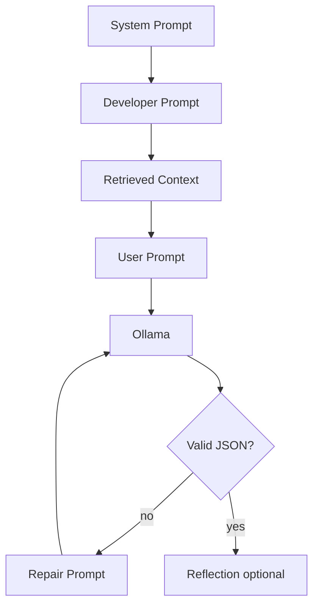

Version prompts as `system.v1.md`; eval suite MUST pass before promotion (Implementation Guide §14).

### 13.15 AI Evaluation Framework

| Dimension | Measurement |
|-----------|-------------|
| Faithfulness | LLM-as-judge + citation check |
| Relevance | Rubric 1–5 |
| Completeness | Pydantic + business rules |
| Hallucination | Judge + numeric audit |
| Latency | `agent_executions.latency_ms` |
| JSON validity | Schema pass rate |
| Business usefulness | User thumbs + surveys |

Eval code in `ai/evaluation/`. CI gates: 100% schema pass on fixtures; faithfulness within 2% of baseline; latency within NFR-PERF-003.

Human review triggers: 3 consecutive module failures; faithfulness under 3/5; user edit over 40% of content (feeds §33.4).

---

## 14. Screen Specifications

Application shell: authenticated layout with sidebar (projects, modules), main content, and run status toasts/SSE subscription.

### 14.1 Screen Inventory

| Screen | Route (conceptual) | Purpose |
|--------|-------------------|---------|
| Login | `/login` | Authenticate |
| Register | `/register` | Create account |
| Project List | `/projects` | Dashboard of projects |
| Project Create | `/projects/new` | Capture name + idea brief |
| Project Overview | `/projects/[id]` | Module grid, progress, quick actions |
| Module Detail | `/projects/[id]/modules/[key]` | Run workflow, status, link to artifact |
| Artifact Viewer | `/projects/[id]/artifacts/[artifactId]` | JSON/markdown view, edit, versions |
| Workflow Run Detail | `/projects/[id]/runs/[runId]` | Step timeline, errors, SSE live updates |
| Export | `/projects/[id]/export` | Investor pack generation |
| Settings | `/settings` | Profile (minimal v1) |

### 14.2 Screen Specification Standard

Every screen MUST define: **Purpose**, **Components**, **API Calls**, **Loading State**, **Empty State**, **Success State**, **Error State**, **Permissions**, **Navigation**. Sections 14.3–14.14 apply this standard.

### 14.3 Project Overview

| Area | Specification |
|------|----------------|
| Purpose | Central command surface for module progress and quick actions |
| Route | `/projects/[id]` |
| Components | `ProjectHeader`, `ModuleGrid`, `ModuleCard`, `ProgressBar`, `RecentRunsList` |
| API Calls | `GET /projects/{id}`, `GET /projects/{id}/modules`, optional recent runs query |
| Loading | Skeleton grid for module cards; header shimmer |
| Empty | N/A (modules always seeded) |
| Success | All modules render with correct status badges |
| Error | `404` → redirect to project list with toast |
| Permissions | Bearer required; project owner only |
| Navigation | Sidebar: Projects, Settings; cards → Module Detail; runs → Run Detail |

### 14.4 Module Detail

| Area | Specification |
|------|----------------|
| Purpose | Run workflow, monitor status, open artifact |
| Route | `/projects/[id]/modules/[key]` |
| Components | `DependencyBanner`, `RunWorkflowButton`, `RunHistoryTable`, `SSEStatusBadge`, `CancelRunButton` |
| API Calls | `GET .../modules/{key}`, `POST .../workflows/{key}/run`, `GET .../workflows/runs`, SSE events |
| Loading | Module status spinner; disabled CTA until dependency check returns |
| Empty | No runs yet — show "Run your first workflow" helper text |
| Success | Completed module links to artifact; in-progress shows live steps |
| Error | `409 MODULE_DEPENDENCY_NOT_MET` in banner; `409 WORKFLOW_ALREADY_RUNNING` on CTA |
| Permissions | Owner only |
| Navigation | Breadcrumb: Project → Module name; back to overview |

### 14.5 Artifact Viewer

| Area | Specification |
|------|----------------|
| Purpose | Review, edit, and version AI-generated deliverables |
| Route | `/projects/[id]/artifacts/[artifactId]` |
| Components | `ArtifactTabs`, `MarkdownView`, `JsonTreeView`, `ArtifactEditor`, `VersionSidebar` |
| API Calls | `GET .../artifacts/{id}`, `PATCH .../artifacts/{id}`, `GET .../versions` |
| Loading | Tab skeleton; editor disabled until load completes |
| Empty | N/A when routed with valid id |
| Success | Save toast; version list refreshes |
| Error | `422 SCHEMA_VALIDATION_FAILED` inline on save; `404` redirect |
| Permissions | Owner only |
| Navigation | From Module Detail or overview; link to originating module |

### 14.6 Login

| Area | Specification |
|------|----------------|
| Purpose | Authenticate returning users |
| Route | `/login` |
| Components | `AuthLayout`, `LoginForm`, `FormField`, `Button`, `Alert` |
| API Calls | `POST /auth/login` |
| Loading | Submit button spinner; fields disabled |
| Empty | N/A |
| Success | Redirect to `/projects` |
| Error | `401 INVALID_CREDENTIALS` alert; preserve email |
| Permissions | Public |
| Navigation | Link to Register |

### 14.7 Register

| Area | Specification |
|------|----------------|
| Purpose | Create account |
| Route | `/register` |
| Components | `RegisterForm`, password strength hint, match validation |
| API Calls | `POST /auth/register` |
| Loading | Submit spinner |
| Success | Redirect to `/projects` |
| Error | `409 EMAIL_ALREADY_EXISTS` on email; `422` field errors |
| Permissions | Public |
| Navigation | Link to Login |

### 14.8 Project List (Dashboard)

| Area | Specification |
|------|----------------|
| Purpose | Hub for all projects |
| Route | `/projects` |
| Components | `ProjectListHeader`, `CreateProjectButton`, `ProjectCard`, `EmptyState`, pagination |
| API Calls | `GET /projects?page=&page_size=` |
| Loading | Card skeleton grid |
| Empty | Illustration + "Create your first project" CTA |
| Success | Paginated cards with name, tagline, progress, updated_at |
| Error | Toast on fetch failure; retry button |
| Permissions | Authenticated user sees own projects only |
| Navigation | Card → Project Overview; Create → `/projects/new`; Settings in sidebar |

### 14.9 Project Create

| Area | Specification |
|------|----------------|
| Purpose | Capture project context to seed modules and memory |
| Route | `/projects/new` |
| Components | `ProjectCreateForm` (name, tagline, industry, idea_brief with char count) |
| API Calls | `POST /projects` |
| Loading | Submit spinner |
| Success | Redirect to Project Overview with Idea Validation available |
| Error | `422` field-level errors; brief under 50 chars blocked client-side |
| Permissions | Authenticated |
| Navigation | Cancel → project list |

### 14.10 Workflow Run Detail

| Area | Specification |
|------|----------------|
| Purpose | AI pipeline transparency and failure diagnosis |
| Route | `/projects/[id]/runs/[runId]` |
| Components | `RunHeader`, `StepTimeline`, `AgentExecutionList`, `ErrorPanel`, `LiveBadge` |
| API Calls | `GET .../workflows/runs/{run_id}`, SSE `.../runs/{run_id}/events` |
| Loading | Timeline skeleton until first step event |
| Empty | N/A |
| Success | Terminal `completed` links to artifact |
| Error | Failed run shows `error_code`, message, retry link to Module Detail |
| Permissions | Owner only |
| Navigation | Breadcrumb: Project → Module → Run |

### 14.11 Export (Investor Pack)

| Area | Specification |
|------|----------------|
| Purpose | Download consolidated investor materials |
| Route | `/projects/[id]/export` |
| Components | `ExportForm`, `ArtifactReadinessList`, `DownloadButton` |
| API Calls | `GET .../artifacts`, `POST .../export/investor-pack` |
| Loading | Generate button spinner |
| Empty | Checklist shows missing artifact types |
| Success | Download via `download_url` |
| Error | `409 INSUFFICIENT_ARTIFACTS` with missing types listed |
| Permissions | Owner only |
| Navigation | From Project Overview export CTA |

### 14.12 Settings (Profile)

| Area | Specification |
|------|----------------|
| Purpose | Account identity and logout |
| Route | `/settings` |
| Components | `ProfileCard`, `LogoutButton` |
| API Calls | `GET /auth/me`, `POST /auth/logout` |
| Loading | Profile skeleton |
| Success | Profile displayed |
| Error | Auth failure redirects to login |
| Permissions | Authenticated |
| Navigation | Sidebar from any app route |

### 14.13 Shared App Shell

| Area | Specification |
|------|----------------|
| Components | `Sidebar`, `TopBar`, `Toast`, auth guard wrapper |
| API Calls | `GET /auth/me` on boot; refresh on 401 |
| Permissions | `(app)/*` requires valid session |
| Navigation | Global: Projects, Settings; in-project: modules, export |

### 14.14 Design System

shadcn/ui primitives, Tailwind design tokens, Framer Motion for module cards and run progress. TanStack Query for server state; SSE with 5s poll fallback when EventSource disconnects.

---

## 15. AI Workflow

### 15.1 Standard Module Graph

Every module graph implements the same logical pipeline (Implementation Guide §12.3):

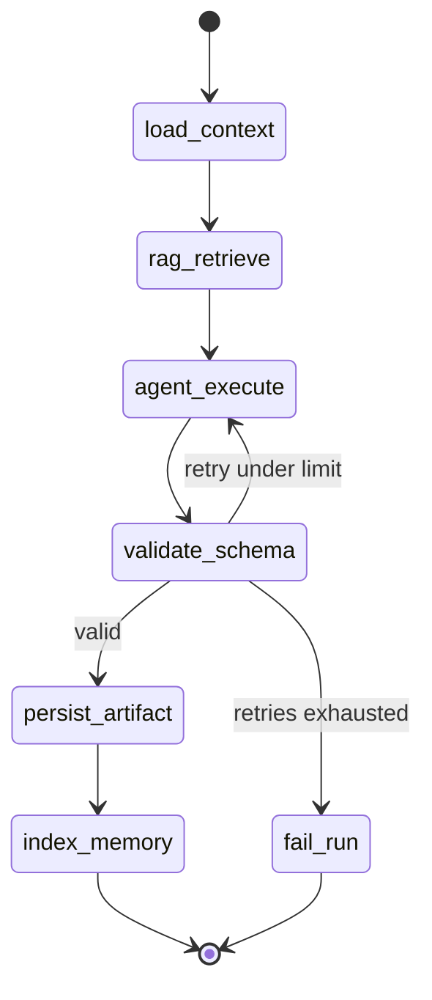

### 15.2 WorkflowState (Conceptual)

| Field | Description |
|-------|-------------|
| `project_id` | Active project |
| `module_key` | Module being executed |
| `run_id` | workflow_runs.id |
| `input_snapshot` | Options from API |
| `retrieved_chunks` | RAG results |
| `draft_output` | Parsed agent JSON |
| `errors` | Accumulated failure messages |

Full schema: Section 20.

### 15.3 Retrieval Policy

Before `agent_execute`, `rag_retrieve` MUST:

1. Embed query composed of module intent + idea brief excerpt.
2. Search project FAISS index with `top_k=8`.
3. Optionally filter by `module_key` metadata for specialist focus.
4. Inject chunk text into prompt with source labels (artifact type, title).

### 15.4 AI Error Handling Pipeline

AI failures use a dedicated escalation path distinct from HTTP errors:

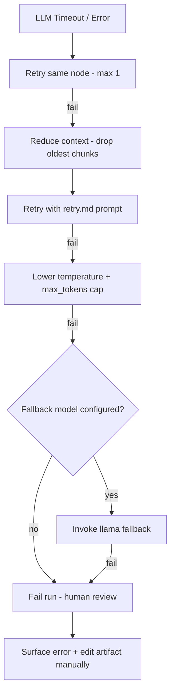

| Failure | First response | Escalation |
|---------|----------------|------------|
| LLM timeout | Retry once | Smaller context + retry prompt |
| Context overflow | Trim retrieval to top 4 chunks | Retry |
| JSON parse error | Repair prompt | Max 2 repairs |
| Schema validation | Repair + reflection | Fail with `SCHEMA_VALIDATION_FAILED` |
| Ollama unavailable | No graph start | Readiness 503; UI degraded banner |
| Insufficient input | Pre-agent gate | `INSUFFICIENT_INFORMATION`; prompt user to enrich brief |

Future v2: optional cloud model fallback when local model fails (Section 32).

### 15.5 Failure and Retry (Summary)

| Failure Type | Behavior |
|--------------|----------|
| Ollama timeout | Step failed; retry whole step once |
| JSON parse error | Retry agent with repair prompt |
| Schema validation | Retry up to 2 times; then run `failed` |
| Dependency missing | Fail at API gate before graph start |

### 15.6 Human Re-Run

User-triggered re-run with `force_regenerate: true` creates new workflow_run, new artifact version on success, and re-indexes memory. Prior versions remain in `artifact_versions`.

---

# Part III — Software Design

## 16. System Architecture

### 16.1 Logical Architecture

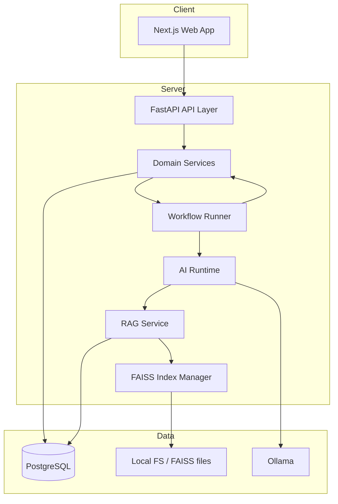

### 16.2 Service Boundaries

| Boundary | Responsibility |
|----------|----------------|
| Web App | UI, auth token handling, SSE client, no direct Ollama access |
| API Layer | HTTP, validation, authz, DTO mapping |
| Domain Services | Projects, artifacts, workflows, export |
| Workflow Runner | LangGraph invoke, step persistence |
| AI Runtime | LLM client, agent nodes, schema validation |
| RAG Service | Chunk, embed, search, re-index |

### 16.3 Deployment Unit (v1)

Monorepo with three runnable processes in Docker Compose: `frontend`, `backend`, `postgres`, plus host or container for `ollama`. FAISS indexes stored on backend volume (`/data/faiss/{project_id}`).

### 16.4 Future Decomposition

API and worker split, managed vector DB, separate embedding service—see NFR-SCALE-*.

---

## 17. Frontend Architecture

### 17.1 Stack and Responsibilities

Next.js App Router handles routing, server components for initial auth gate, client components for interactive module and artifact views. TanStack Query manages server state; mutations invalidate project/module/artifact queries.

### 17.2 Route Structure

| Path | Rendering |
|------|-----------|
| `(auth)/login`, `register` | Client forms |
| `(app)/projects` | Server list + client pagination |
| `(app)/projects/[id]/**` | Mixed; SSE hooks client-only |

### 17.3 State Management

| State Type | Approach |
|------------|----------|
| Server data | TanStack Query caches keyed by project_id |
| Auth session | Access token in memory; refresh via httpOnly cookie |
| Workflow progress | SSE EventSource + query invalidation on terminal events |
| UI local | React useState for editors |

### 17.4 API Client Layer

Single `lib/api` module: typed fetch wrapper, attaches Bearer token, normalizes error envelope from Document 3 §15.

### 17.5 Component Layers

| Layer | Examples |
|-------|----------|
| ui/ | shadcn primitives |
| features/modules/ | ModuleCard, RunWorkflowButton |
| features/artifacts/ | ArtifactViewer, ArtifactEditor |
| features/workflows/ | RunTimeline, SSEProvider |
| layouts/ | AppShell, ProjectSidebar |

### 17.6 Design Decisions

App Router chosen for layout nesting and future SSR auth checks. No global Redux—Query sufficient for v1 scope.

---

## 18. Backend Architecture

### 18.1 Layered Structure

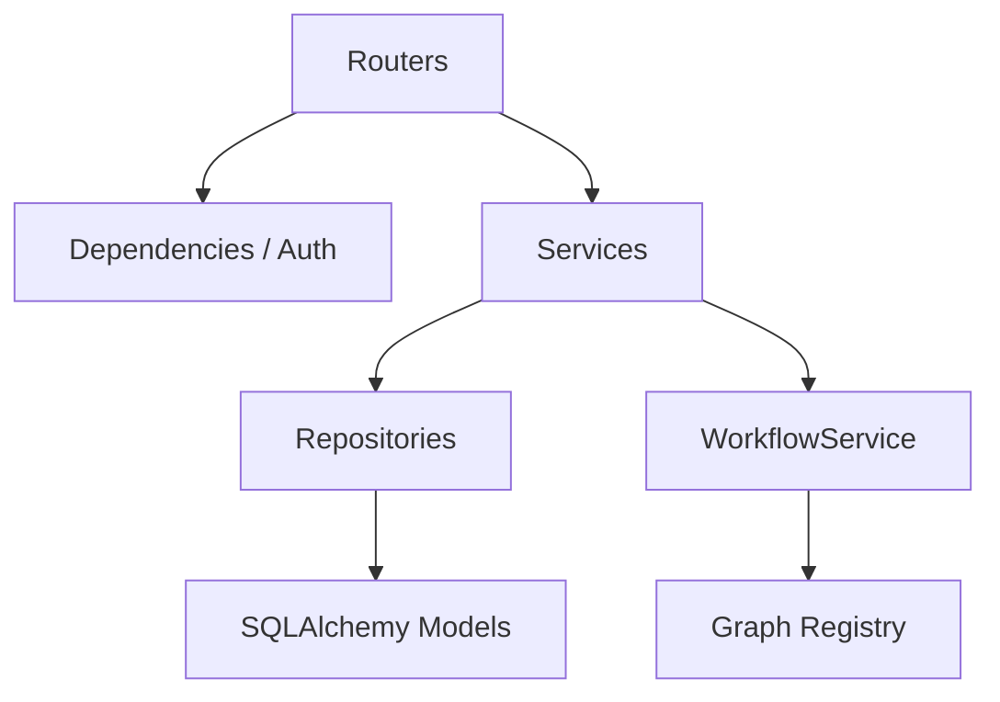

### 18.2 Router Groups

Mirrors Document 3 §10: health, auth, projects, modules, artifacts, workflows, memory, export.

### 18.3 Services

| Service | Responsibility |
|---------|----------------|
| AuthService | Register, login, tokens |
| ProjectService | CRUD, module seeding |
| ModuleService | Status, dependency evaluation |
| ArtifactService | Upsert, version, schema validate |
| WorkflowService | Trigger, cancel, status, SSE broadcast |
| MemoryService | Chunk, index, search |
| ExportService | Merge artifacts to markdown bundle |

### 18.4 Background Execution

v1: FastAPI `BackgroundTasks` or asyncio task for graph invoke. Future: Celery/RQ queue with same WorkflowService interface.

### 18.5 Design Decisions

Repository pattern isolates SQLAlchemy from services for testability. LangGraph graphs invoked only from WorkflowService to centralize persistence hooks.

---

## 19. AI Architecture

### 19.1 Inference Pipeline

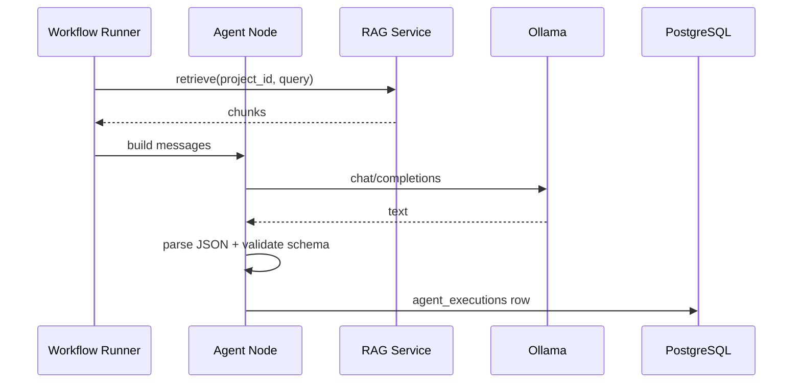

### 19.2 Model Configuration

| Setting | v1 Value |
|---------|----------|
| Provider | Ollama HTTP API |
| Model | `qwen3:8b` |
| Temperature | 0.3 default for structured outputs |
| Max tokens | Module-specific caps in agent config |

Future Llama models plug in via `ai/runtime/model_registry.py` without changing graph topology.

### 19.3 Structured Output Strategy

Primary: JSON mode instruction + schema in system prompt. Fallback: strip markdown fences, `json.loads`, Pydantic validation, repair retry.

### 19.4 Resource Considerations

Embedding model loaded once per backend process. Ollama may run on GPU host; backend connects via `OLLAMA_BASE_URL`.

### 19.5 Per-Agent Model Configuration

Default model: `qwen3:8b` via Ollama. Override per agent in `ai/config/agents.yaml`.

| Agent | Model | Temp | Top P | Top K | Context | Max Tokens | Stop | Seed |
|-------|-------|------|-------|-------|---------|------------|------|------|
| `idea_validator` | qwen3:8b | 0.3 | 0.9 | 40 | 8192 | 2048 | — | 42 |
| `market_researcher` | qwen3:8b | 0.35 | 0.9 | 40 | 8192 | 3072 | — | 42 |
| `business_modeler` | qwen3:8b | 0.3 | 0.85 | 40 | 8192 | 2560 | — | 42 |
| `product_strategist` | qwen3:8b | 0.35 | 0.9 | 40 | 8192 | 2560 | — | 42 |
| `technical_architect` | qwen3:8b | 0.25 | 0.85 | 30 | 8192 | 3072 | — | 42 |
| `financial_analyst` | qwen3:8b | 0.2 | 0.8 | 30 | 8192 | 4096 | — | 42 |
| `marketing_strategist` | qwen3:8b | 0.35 | 0.9 | 40 | 8192 | 2560 | — | 42 |
| `investor_writer` | qwen3:8b | 0.3 | 0.85 | 40 | 12288 | 4096 | — | 42 |

**Retry overrides:** temperature −0.1, max_tokens ×0.75, context trimmed to 4096. **Future fallback:** `llama3:8b` when configured in `ai/models/model_factory.py`.

### 19.6 AI Error Handling

See Section 15.4 for the full escalation pipeline. Implementation lives in `ai/runtime/error_handler.py` and `ai/nodes/repair_node.py`.

### 19.7 AI Guardrails

| Guardrail | Location | Behavior |
|-----------|----------|----------|
| Schema validation | `ai/guardrails/schema_validation.py` | Pydantic enforce before persist |
| Output validation | `ai/guardrails/output_validation.py` | Business rules (counts, numeric sanity) |
| Prompt injection filter | `ai/guardrails/prompt_injection.py` | Strip/flag instruction-like patterns in brief |
| Moderation (optional) | `ai/guardrails/moderation.py` | Block disallowed content categories |

### 19.8 AI Evaluation (Runtime)

Offline eval: Section 13.15. Online telemetry: log faithfulness proxy (reflection pass/fail), retry count, repair invocations per `agent_executions.metadata_json`.

---

## 20. LangGraph Workflow

### 20.1 Graph Topology Overview

v1 uses **one compiled graph per module** plus a conceptual **startup lifecycle graph** for documentation and future orchestration:

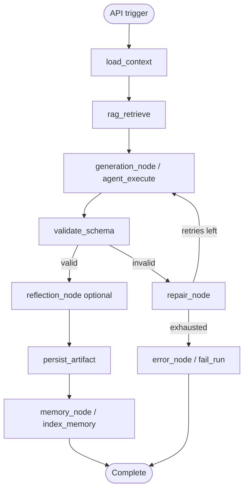

**Mega-graph (future):** Idea Validation → Market → Business → Product → Architecture → Finance → Marketing → Investor — v1 executes modules independently via API; dependencies enforced by gates not a single graph.

### 20.2 WorkflowState Schema

| Field | Type | Description |
|-------|------|-------------|
| `project_id` | UUID | Project scope |
| `module_key` | string | Active module |
| `run_id` | UUID | workflow_runs.id |
| `user_id` | UUID | Triggering user |
| `input_snapshot` | dict | API options |
| `project_context` | dict | name, brief, industry |
| `required_artifacts` | dict | Loaded upstream JSON by type |
| `retrieved_chunks` | list | RAG results with scores |
| `messages` | list | Assembled prompt messages |
| `draft_output` | dict \| null | Parsed agent JSON |
| `validation_errors` | list | Schema/business rule errors |
| `retry_count` | int | Repair/generation retries |
| `reflection_passed` | bool | Optional quality gate |
| `errors` | list | Terminal error messages |

Implemented in `ai/graphs/state.py` as TypedDict or Pydantic model.

### 20.3 Node Definitions

| Node | File | Input | Output | Persistence |
|------|------|-------|--------|-------------|
| `load_context` | `ai/nodes/context_loader.py` | project_id, module_key | project_context, required_artifacts | workflow_step: load_context |
| `rag_retrieve` | `ai/nodes/rag_node.py` | query from module template | retrieved_chunks | workflow_step: rag_retrieve |
| `generation_node` | `ai/nodes/generation_node.py` | messages | raw LLM text | agent_executions row |
| `validate_schema` | `ai/nodes/validation_node.py` | draft_output | validation_errors or pass | workflow_step: validate |
| `repair_node` | `ai/nodes/repair_node.py` | errors + raw output | updated messages | metadata retry_count |
| `reflection_node` | `ai/nodes/reflection_node.py` | draft_output + sources | reflection_passed | optional step log |
| `persist_artifact` | `ai/nodes/export_node.py` | draft_output | artifact_id | artifacts + versions |
| `memory_node` | `ai/nodes/memory_node.py` | artifact_id | chunk ids | memory_chunks + FAISS |
| `error_node` | `ai/nodes/error_node.py` | errors | terminal status | workflow_run failed |

### 20.4 Edges and Conditional Routing

| From | To | Condition |
|------|-----|-----------|
| `load_context` | `rag_retrieve` | always |
| `rag_retrieve` | `generation_node` | always |
| `generation_node` | `validate_schema` | always |
| `validate_schema` | `reflection_node` | valid && module uses reflection |
| `validate_schema` | `repair_node` | invalid && retry_count < max |
| `validate_schema` | `error_node` | invalid && retries exhausted |
| `reflection_node` | `persist_artifact` | reflection_passed |
| `reflection_node` | `repair_node` | !reflection_passed && retries left |
| `repair_node` | `generation_node` | retry |
| `persist_artifact` | `memory_node` | always |
| `memory_node` | END | always |
| `error_node` | END | always |

`max_retries` default: 2 (configurable per module in `ai/config/graphs.yaml`).

### 20.5 Graph Registry

One compiled graph per `module_key` in `ai/graphs/` (`validation_graph.py`, etc.). Factory: `ai/graphs/graph_factory.py`.

### 20.6 Reflection Node

Used for `business_modeler`, `investor_writer`. Runs validation.md + reflection.md against draft; checks cross-field consistency and unsupported claims.

### 20.7 Checkpointing and Correlation

v1: DB persistence at each node boundary via WorkflowService hooks. LangGraph in-memory state during execution. Every node updates matching `workflow_steps` row by `step_key` + `sequence`.

---

## 21. RAG Architecture

### 21.1 Index Scope

Per-project FAISS index plus metadata in `memory_chunks`. Global `knowledge_documents` seeded into project index on first workflow or project create.

### 21.2 Chunking Strategy

| Source | Strategy |
|--------|----------|
| idea_brief | Single chunk if <512 tokens; else split by paragraph with 50-token overlap |
| artifact markdown | Split 512 tokens, overlap 50 |
| artifact json | Flatten key sections to text lines, then chunk |
| knowledge docs | Same as markdown |

### 21.3 Embedding Pipeline

Model: `BAAI/bge-base-en-v1.5` via Sentence Transformers. Normalize embeddings for inner-product search in FAISS IndexFlatIP.

### 21.4 Retrieval Flow

Query embedded at runtime → FAISS search → join `memory_chunks` by `faiss_vector_id` → rank and filter → return to agent.

### 21.5 Invalidation

On artifact update or idea brief PATCH, delete chunks where `source_id` matches and re-index; rebuild FAISS index for project (v1 acceptable for moderate size).

### 21.6 Design Decisions

FAISS chosen for v1 zero-ops local deploy. Swap to pgvector or Pinecone when NFR-SCALE-002 triggers.

### 21.7 Knowledge Base Design

Curated static knowledge lives under `data/knowledge/` and is ingested into `knowledge_documents` + per-project FAISS on first workflow.

```
data/knowledge/
├── startup/           # Ideation, validation, founder playbooks
├── finance/           # Unit economics, modeling guides
├── marketing/         # GTM, positioning, channels
├── product/           # Roadmapping, MVP scoping
├── software/          # Engineering practices
├── architecture/      # System design patterns
├── pitch_decks/       # Deck structure examples
├── case_studies/      # Anonymized startup narratives
├── templates/         # Module-specific output templates
├── legal/             # High-level compliance checklists (not legal advice)
└── books/             # Excerpts / summaries (licensed content only)
```

| Parameter | Value | Rationale |
|-----------|-------|-----------|
| Chunk size | 512 tokens | Balance context vs granularity |
| Overlap | 50 tokens | Preserve sentence boundaries across chunks |
| Embedding model | BAAI/bge-base-en-v1.5 | Strong English semantic search |
| Normalization | L2 normalize | Inner product ≈ cosine similarity |
| Index type | FAISS IndexFlatIP | Simple, exact search for v1 scale |
| top_k (default) | 8 | Fits context budget with project chunks |
| Retrieval strategy | Hybrid: project chunks first, then knowledge; optional module_key metadata filter |
| Reranker | `ai/rag/reranker.py` optional v1.1 | Cross-encoder rerank top 20 → 8 |

**Metadata per chunk:** `source_type`, `source_id`, `module_key`, `category`, `title`, `document_slug`.

**Ingestion:** `scripts/build_index.py` loads markdown from `data/knowledge/**`, writes DB rows, builds global embedding cache copied into project indexes at seed time.

---

## 22. Memory Architecture

### 22.1 Memory Types

| Type | Scope | Storage | Used By |
|------|-------|---------|---------|
| **Short-term (working)** | Single workflow run | LangGraph WorkflowState | All graph nodes during run |
| **Long-term (project)** | Project lifetime | PostgreSQL `memory_chunks` + FAISS | RAG retrieve, agents |
| **Project memory** | Per project | Derived from brief + artifacts | All modules |
| **Conversation memory** | v1 minimal | Not chat-first; future session turns | Future multi-turn clarifications |
| **Knowledge memory** | Global curated | `knowledge_documents` → chunks | RAG bootstrap |
| **User memory** | Per user | Future: preferences, expertise level | Future personalization |
| **Artifact memory** | Per artifact version | Chunks with `source_type=artifact` | Downstream modules, investor writer |

### 22.2 Memory Lifecycle

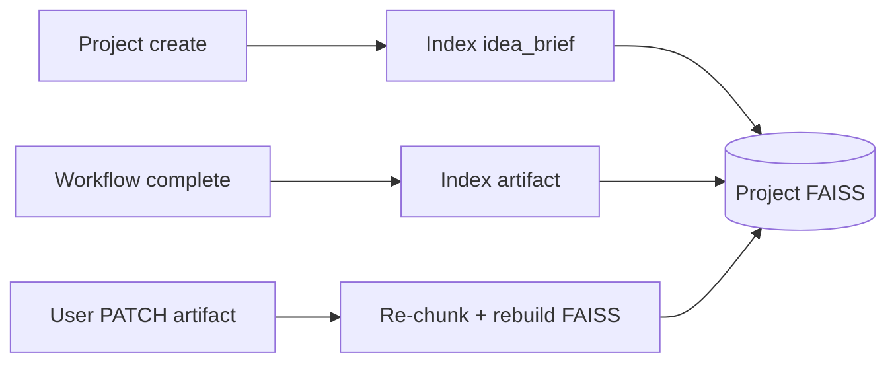

### 22.3 Memory Manager

`ai/memory/memory_manager.py` coordinates: chunking, embedding, FAISS upsert/delete, PostgreSQL metadata. Summarization for oversized artifacts: `ai/memory/summarizer.py` (future v1.1).

### 22.4 Provenance

Every chunk records `source_type`, `source_id`, `module_key`, and `metadata_json` for UI citation (future) and debug.

### 22.5 Deduplication

`content_hash` prevents duplicate chunks on re-index unless force flag set.

### 22.6 Privacy

Project memory isolated by `project_id`; search MUST filter index file per project; no cross-project retrieval.

---

## 23. Database Design

### 23.1 Overview

PostgreSQL 16 relational store for all durable entities. Full column-level specification: **Document 3 §3**. ER diagram: **Document 3 §5**.

### 23.2 Entity Groups

| Group | Tables |
|-------|--------|
| Identity | users, refresh_tokens |
| Project | projects, project_modules |
| Content | artifacts, artifact_versions |
| Execution | workflow_runs, workflow_steps, agent_executions |
| Intelligence | memory_chunks, knowledge_documents |
| Audit | audit_logs |

### 23.3 Migration Strategy

Alembic migrations ordered per Implementation Guide §9.1. No manual schema drift.

### 23.4 JSONB Usage

Artifact payloads and workflow snapshots use JSONB for flexible schema evolution with application-layer Pydantic validation.

---

## 24. API Design

### 24.1 Principles

REST over JSON, resource-oriented URLs, explicit HTTP status codes, consistent error envelope, pagination on collections.

### 24.2 Versioning

All routes prefixed `/api/v1` (Document 3 §7).

### 24.3 Idempotency

Workflow trigger is not idempotent—concurrent guard returns 409. Artifact PATCH is last-write-wins with versioning.

### 24.4 Contract Source

Endpoint list, request/response models, validation, and error codes: **Document 3**. This section defines principles only to avoid duplication.

### 24.5 Deprecation Policy

| Rule | Detail |
|------|--------|
| Notice period | Minimum 90 days for deprecated endpoints |
| Communication | `Deprecation` HTTP header + changelog in `docs/` |
| Sunset | Returns `410 GONE` after sunset date with migration link |
| Version coexistence | v1 and v2 may run in parallel during migration window |

### 24.6 Breaking Change Policy

Breaking changes require new major API version (`/api/v2`). Examples: removing fields, changing field types, renaming endpoints, altering auth scheme.

Non-breaking: adding optional fields, new endpoints, new enum values (clients must ignore unknown fields).

### 24.7 Backward Compatibility

Clients MUST ignore unknown JSON fields. Servers MUST NOT remove required fields without version bump. Artifact schemas evolve via optional new keys only within v1; required key removal triggers schema version in `content_json._schema_version` (future).

---

## 25. Authentication

### 25.1 Flow

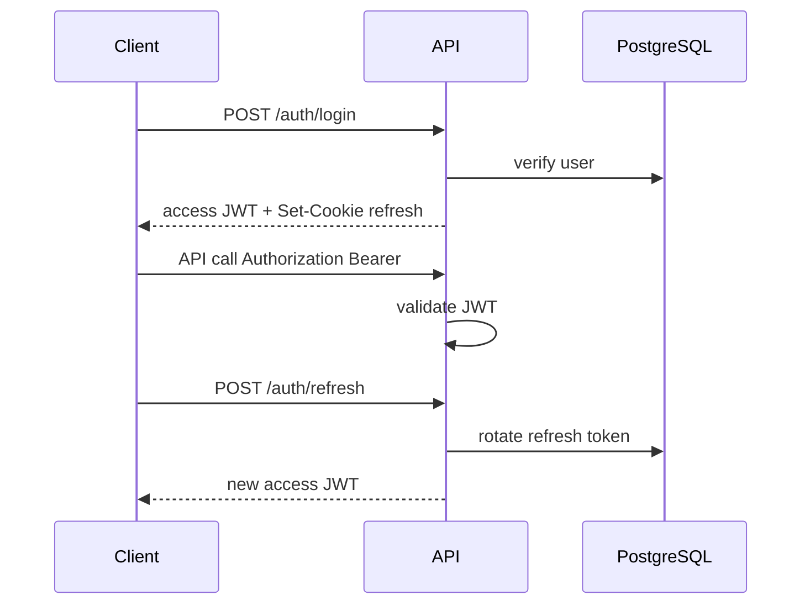

### 25.2 Token Lifetimes

Access: 15 minutes. Refresh: 7 days with rotation on each refresh.

### 25.3 Password Policy

Minimum 8 characters with letter and number; bcrypt cost 12.

### 25.4 Frontend Integration

Prefer httpOnly refresh cookie to reduce XSS token theft; access token short-lived in memory.

---

## 26. Security

### 26.1 Threat Model (v1)

| Threat | Mitigation |
|--------|------------|
| Unauthorized project access | Owner check on every project route |
| Token theft | Short access TTL, httpOnly refresh, HTTPS in prod |
| Injection | ORM parameterized queries; Pydantic input validation |
| Prompt injection via brief | Sanitize length; agents instructed to treat user content as untrusted data |
| Secrets in repo | Env vars only; `.env` gitignored |

### 26.2 Data Classification

Idea briefs and artifacts are **confidential user data**; not used for model training in v1.

### 26.3 Rate Limiting

Login endpoint rate limited (429) via middleware or reverse proxy in staging/prod.

### 26.4 AI Security

| Threat | Vector | Mitigation |
|--------|--------|------------|
| **Prompt injection** | Malicious instructions in idea_brief or edits | Treat user content as data; system prompts forbid obeying embedded commands; `ai/guardrails/prompt_injection.py` |
| **Context poisoning** | User edits artifact to mislead downstream agents | Reflection node; provenance labels in retrieval; investor agent numeric audit |
| **Knowledge base poisoning** | Compromised seed files | Signed knowledge bundles; CI hash check on `data/knowledge/`; admin-only ingest (future) |
| **Jailbreak attempts** | Auth screens or future chat | No generic chat v1; moderation guardrail optional |
| **Output validation** | Harmful or non-business content | Schema + business rules; block persist on hard failures |
| **Inference abuse** | Repeated workflow triggers | Per-user rate limit on workflow POST; concurrent run guard |
| **Model exfiltration** | Long prompts | Max input length; chunk limits |

User data is NOT used for model training in v1 (Section 26.2).

---

## 27. Logging and Observability

### 27.1 Log Categories

| Category | Logger / Store | Contents |
|----------|----------------|----------|
| **Application** | stdout JSON | HTTP requests, unhandled exceptions |
| **Workflow** | stdout + DB steps | Run/step status transitions, duration |
| **Agent** | stdout + agent_executions | agent_id, status, retry_count, reflection result |
| **Inference** | stdout (debug gated) | model, latency_ms, token counts — no full prompts in prod |
| **Database** | SQLAlchemy slow query log | Queries >500ms |
| **Audit** | audit_logs table | Security-sensitive user actions |

### 27.2 Log Format

Structured JSON: `timestamp`, `level`, `message`, `request_id`, `user_id`, `project_id`, `workflow_run_id`.

### 27.3 What to Log

HTTP requests (path, status, duration), workflow state transitions, agent execution outcomes, export actions.

### 27.4 What Not to Log

Passwords, raw JWTs, full LLM prompts in production (optional debug flag in dev only).

### 27.5 Audit Trail

`audit_logs` table for security-sensitive actions (Document 3 §3.12).

---

## 28. Performance

### 28.1 Reference Hardware

Development baseline: 8 CPU cores, 32 GB RAM, GPU optional for Ollama. Targets in Section 9 assume this baseline.

### 28.2 Optimization levers

| Area | v1 Approach |
|------|-------------|
| API | Connection pooling, indexed queries (Document 3 §6) |
| LLM | Single concurrent run per project recommended in UI |
| Embeddings | Batch embed on index rebuild |
| Frontend | Query staleTime tuning, skeleton loaders |

### 28.3 Caching

No distributed cache v1. Optional in-memory cache for knowledge document chunks shared across projects.

---

## 29. Folder Structure

Canonical monorepo layout (aligned with Developer Implementation Guide §3):

```
foundrai/
├── README.md
├── LICENSE
├── .gitignore
├── .env.example
├── docker-compose.yml
├── Makefile
├── pyproject.toml
├── package.json
├── pnpm-workspace.yaml
│
├── docs/
│   ├── 01-foundrai-product-software-specification.md
│   ├── 02-developer-implementation-guide.md
│   ├── 03-api-database-reference.md
│   ├── diagrams/
│   └── assets/
│
├── frontend/
│   ├── public/
│   └── src/
│       ├── app/              # (auth), dashboard, projects, modules, settings
│       ├── components/       # ui, layout, forms, dashboard, projects, modules, ai, workflow
│       ├── hooks/
│       ├── lib/
│       ├── services/
│       ├── store/
│       ├── context/
│       ├── utils/
│       ├── constants/
│       ├── types/
│       ├── styles/
│       ├── config/
│       └── middleware.ts
│
├── backend/
│   └── app/
│       ├── api/v1/           # auth, projects, modules, workflows, artifacts, memory, export, health
│       ├── core/
│       ├── auth/
│       ├── database/
│       ├── models/
│       ├── schemas/
│       ├── repositories/
│       ├── services/
│       ├── middleware/
│       ├── background/
│       ├── exporters/
│       ├── validators/
│       ├── telemetry/
│       └── main.py
│   ├── alembic/
│   └── tests/
│
├── ai/
│   ├── agents/               # One directory per domain agent + manager/
│   ├── graphs/               # Per-module LangGraph + graph_factory.py
│   ├── nodes/                # context_loader, rag, generation, validation, repair, reflection, memory
│   ├── prompts/              # system/, developer/, agents/, repair/, reflection/
│   ├── rag/                  # chunking, embeddings, indexing, retrieval, reranker, pipeline
│   ├── memory/               # project, artifact, conversation, memory_manager, summarizer
│   ├── models/               # ollama, qwen, llama, model_factory, settings
│   ├── tools/                # calculator, search, validator, exporter
│   ├── evaluation/           # metrics, quality, hallucination, benchmark, evaluator
│   ├── guardrails/           # prompt_injection, schema_validation, output_validation, moderation
│   ├── schemas/              # Artifact Pydantic models
│   ├── runtime/              # Ollama client, error_handler
│   ├── config/
│   └── utils/
│
├── data/
│   ├── knowledge/            # startup, finance, marketing, product, software, architecture, etc.
│   ├── embeddings/
│   ├── faiss/
│   ├── uploads/
│   ├── exports/
│   └── cache/
│
├── scripts/                  # setup, seed, build_index, backup, reset_dev
├── docker/                   # Dockerfile.frontend, Dockerfile.backend, nginx.conf
├── nginx/
├── monitoring/               # prometheus, grafana (future)
├── tests/                    # integration, e2e, ai, backend, frontend, performance
├── .github/workflows/
└── assets/
```

Implementation Guide §4 contains scaffold commands for this tree.

---

## 30. Deployment Architecture

### 30.1 Docker Compose Services (v1)

| Service | Image / Build | Ports |
|---------|-------------|-------|
| frontend | Build `docker/Dockerfile.frontend` | 3000 |
| backend | Build `docker/Dockerfile.backend` | 8000 |
| postgres | postgres:16+ | 5432 |
| ollama | ollama/ollama (optional service) | 11434 |

Volumes: `postgres_data`, `faiss_data` (→ `FAISS_DATA_DIR`), `ollama_models`, `data/exports`.

### 30.2 Environment Variables (Key)

| Variable | Service | Purpose |
|----------|---------|---------|
| `DATABASE_URL` | api | PostgreSQL DSN |
| `JWT_SECRET` | api | Signing key |
| `OLLAMA_BASE_URL` | api | Inference endpoint |
| `FAISS_DATA_DIR` | api | Index storage |
| `NEXT_PUBLIC_API_URL` | web | API base |

### 30.3 Future AWS Topology

ALB → ECS/Fargate (frontend + backend), RDS PostgreSQL, EFS for FAISS or migration to OpenSearch/pgvector, GPU EC2 or SageMaker for Ollama/vLLM. Not implemented v1.

---

## 31. Risks

| ID | Risk | Impact | Mitigation |
|----|------|--------|------------|
| R-1 | Local model quality insufficient | Poor artifacts | Eval suite; prompt iteration; future cloud model routing |
| R-2 | Long workflow latency | User drop-off | SSE progress, async 202, set expectations in UI |
| R-3 | FAISS rebuild cost at scale | Slow edits | Background re-index job; vector DB migration path |
| R-4 | Schema validation failures | Failed runs | Retry policy, user-visible errors, manual edit fallback |
| R-5 | Single-owner model limits teams | Market fit | Roadmap team features |
| R-6 | Ollama outage | No AI runs | Readiness probe, clear degraded mode messaging |

---

## 32. Future Roadmap

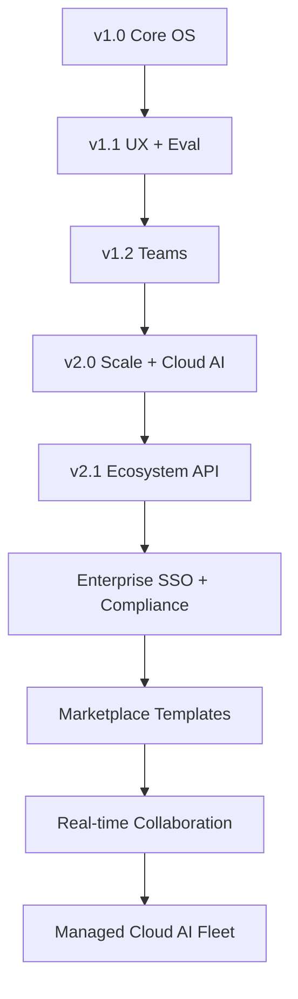

| Phase | Theme | Deliverables |
|-------|-------|--------------|
| **v1.0** | Core OS | 8 modules, JWT auth, RAG, FAISS memory, investor export, Docker |
| **v1.1** | UX + quality | PDF export, artifact diff, email notifications, reranker, expanded eval dashboard |
| **v1.2** | Teams | Invites, roles (owner/editor/viewer), shared projects |
| **v2.0** | Scale | Queue workers, pgvector, optional cloud LLMs (OpenAI/Anthropic), Llama production path |
| **v2.1** | Ecosystem | Notion/Google export, public API keys, webhooks |
| **v3.0 Enterprise** | Compliance | SSO/SAML, audit exports, dedicated VPC deploy, SLA |
| **v3.1 Marketplace** | Templates | Industry playbook packs, agent templates, accelerator bundles |
| **v3.2 Collaboration** | Multiplayer | Live co-editing, comments, mentor review mode |
| **v4.0 Cloud AI** | Managed inference | FoundrAI-hosted GPU pool, model routing, cost controls |

---

## 33. Success Metrics

### 33.1 Product Metrics

| Metric | Target (90 days post-launch) |
|--------|------------------------------|
| Activation rate | ≥60% new users create project |
| Module completion rate | ≥40% complete ≥4 modules |
| Export rate | ≥25% of active projects generate investor pack |
| Workflow success rate | ≥85% runs complete without failure |

### 33.3 Engineering and AI Metrics

| Metric | Target |
|--------|--------|
| Schema-valid agent outputs (offline eval) | ≥85% |
| API uptime (staging) | 99.5% |
| p95 non-AI API latency | <300 ms |
| Average workflow time (per module) | <8 min p95 |
| Average LLM latency (per agent execution) | <90s p95 |
| RAG retrieval precision@8 (eval set) | ≥75% |
| Average retry count per successful run | <0.5 |
| Artifact generation time (persist step) | <2s p95 |
| User edit percentage (chars changed / total) | Track baseline; alert if >50% module-wide |
| Module completion rate (funnel) | Track per module 1→8 |
| Workflow success rate | ≥85% |
| JSON validity rate | ≥95% before repair |

### 33.4 Qualitative

User interviews: founders report increased confidence in investor narrative coherence vs. prior chat-only tools.

---

## 34. Glossary

| Term | Definition |
|------|------------|
| Agent | Specialized LLM-driven component producing structured output for one domain |
| Artifact | Persisted structured output (JSON + optional markdown) tied to a project and type |
| Module | Product unit mapping to one workflow and primary artifact type |
| Project Memory | Embeddings and chunks derived from project content for RAG |
| Workflow Run | Single execution instance of a module LangGraph pipeline |
| RAG | Retrieval-Augmented Generation—retrieving chunks before LLM generation |
| LangGraph | Library for stateful multi-step AI workflows as graphs |
| Ollama | Local model server used for Qwen inference in v1 |
| FAISS | Facebook AI Similarity Search library for vector retrieval |
| Idea Brief | Initial free-text description captured at project creation |
| Investor Pack | Exported markdown bundle synthesizing selected artifacts |
| Dependency Gate | Server rule blocking module run until required artifacts exist |

---

*End of Document 1 — FoundrAI Product & Software Specification*
