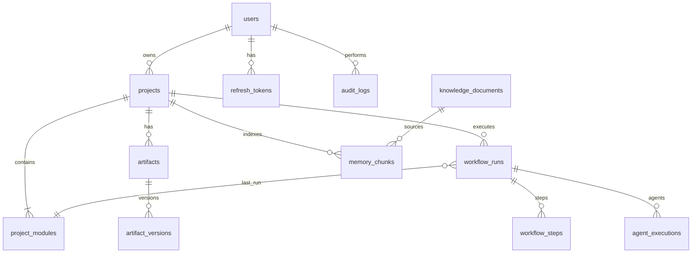

# FoundrAI API & Database Reference

**Product:** FoundrAI – AI Product & Startup Studio  

---

## Document Index

| Doc | Purpose |
|-----|---------|
| [01 — Product & Software Specification](./01-foundrai-product-software-specification.md) | Product scope, architecture (Sections 16–34) |
| [02 — Developer Implementation Guide](./02-developer-implementation-guide.md) | Build order and milestones |
| **03 — API & Database Reference** (this document) | Tables, relationships, REST contracts |

**Base URL (local):** `http://localhost:8000/api/v1`  
**Content-Type:** `application/json` unless noted.

---

## 1. Overview and Conventions

### 1.1 Purpose

This reference defines the canonical PostgreSQL schema and REST API for FoundrAI v1. All services must conform to these contracts. Product behavior is specified in Document 1; implementation sequencing in Document 2.

### 1.2 API Conventions

| Rule | Value |
|------|-------|
| Version prefix | `/api/v1` |
| Resource paths | Plural nouns, kebab-case segments only in multi-word path segments (prefer single tokens) |
| JSON keys | `snake_case` |
| Identifiers | UUID v4, string format in JSON |
| Datetimes | ISO 8601 UTC with `Z` suffix (e.g. `2026-07-21T12:00:00Z`) |
| Nullability | Omitted optional fields may be omitted on response; clients must accept explicit `null` where documented |

### 1.3 Authentication Header

Protected endpoints require:

```http
Authorization: Bearer <access_token>
```

Access token lifetime: 15 minutes. Refresh via Section 8.

---

## 2. Naming Conventions

### 2.1 Database

| Element | Convention | Example |
|---------|------------|---------|
| Tables | Plural `snake_case` | `workflow_runs` |
| Primary key | `id` UUID | `id` |
| Foreign keys | `{entity}_id` | `project_id` |
| Timestamps | `created_at`, `updated_at` | TIMESTAMPTZ NOT NULL |
| Soft delete | `deleted_at` nullable | Only on `projects` v1 |
| Enums | PostgreSQL ENUM or `VARCHAR` + check | `module_status` |
| Indexes | `ix_{table}_{columns}` | `ix_artifacts_project_id` |

### 2.2 API

| Element | Convention | Example |
|---------|------------|---------|
| Path params | `{id}` lowercase | `/projects/{project_id}` |
| Query params | `snake_case` | `page_size`, `module_key` |
| Error codes | `SCREAMING_SNAKE_CASE` | `MODULE_DEPENDENCY_NOT_MET` |

---

## 3. Database Tables

### 3.1 `users`

Stores registered accounts.

| Column | Type | Constraints | Description |
|--------|------|-------------|-------------|
| `id` | UUID | PK, default `gen_random_uuid()` | User identifier |
| `email` | VARCHAR(255) | UNIQUE NOT NULL | Login email |
| `password_hash` | VARCHAR(255) | NOT NULL | bcrypt hash |
| `full_name` | VARCHAR(255) | NOT NULL | Display name |
| `is_active` | BOOLEAN | NOT NULL DEFAULT true | Account enabled |
| `created_at` | TIMESTAMPTZ | NOT NULL DEFAULT now() | Registration time |
| `updated_at` | TIMESTAMPTZ | NOT NULL DEFAULT now() | Last profile update |

**Validation:** Email must be valid format (application-level). Password min 8 chars, max 128 (application-level).

---

### 3.2 `refresh_tokens`

Opaque refresh tokens for session renewal.

| Column | Type | Constraints | Description |
|--------|------|-------------|-------------|
| `id` | UUID | PK | Token row id |
| `user_id` | UUID | FK → `users.id` ON DELETE CASCADE, NOT NULL | Owner |
| `token_hash` | VARCHAR(255) | UNIQUE NOT NULL | SHA-256 of raw token |
| `expires_at` | TIMESTAMPTZ | NOT NULL | Expiry (7 days from issue) |
| `revoked_at` | TIMESTAMPTZ | NULL | Set on logout or rotation |
| `created_at` | TIMESTAMPTZ | NOT NULL DEFAULT now() | Issue time |

---

### 3.3 `projects`

Startup project workspace root.

| Column | Type | Constraints | Description |
|--------|------|-------------|-------------|
| `id` | UUID | PK | Project id |
| `user_id` | UUID | FK → `users.id` ON DELETE CASCADE, NOT NULL | Owner (v1 single-owner) |
| `name` | VARCHAR(255) | NOT NULL | Project title |
| `tagline` | VARCHAR(500) | NULL | Short description |
| `idea_brief` | TEXT | NOT NULL | Initial idea / problem statement |
| `industry` | VARCHAR(100) | NULL | Optional industry tag |
| `stage` | VARCHAR(50) | NOT NULL DEFAULT `draft` | `draft`, `active`, `archived` |
| `deleted_at` | TIMESTAMPTZ | NULL | Soft delete |
| `created_at` | TIMESTAMPTZ | NOT NULL DEFAULT now() | |
| `updated_at` | TIMESTAMPTZ | NOT NULL DEFAULT now() | |

---

### 3.4 `project_modules`

One row per module per project (8 modules seeded on project creation).

| Column | Type | Constraints | Description |
|--------|------|-------------|-------------|
| `id` | UUID | PK | Module instance id |
| `project_id` | UUID | FK → `projects.id` ON DELETE CASCADE, NOT NULL | Parent project |
| `module_key` | VARCHAR(64) | NOT NULL | See Section 3.4.1 |
| `display_name` | VARCHAR(128) | NOT NULL | UI label |
| `status` | VARCHAR(32) | NOT NULL DEFAULT `locked` | `locked`, `available`, `in_progress`, `completed`, `failed` |
| `sort_order` | SMALLINT | NOT NULL | Display order 1–8 |
| `last_run_id` | UUID | FK → `workflow_runs.id` NULL | Latest workflow run |
| `completed_at` | TIMESTAMPTZ | NULL | When module reached `completed` |
| `created_at` | TIMESTAMPTZ | NOT NULL DEFAULT now() | |
| `updated_at` | TIMESTAMPTZ | NOT NULL DEFAULT now() | |

**Unique:** `(project_id, module_key)`

#### 3.4.1 `module_key` Values

| `module_key` | `display_name` |
|--------------|----------------|
| `idea_validation` | Idea Validation |
| `market_research` | Market Research |
| `business_model` | Business Model |
| `product_strategy` | Product Strategy |
| `technical_architecture` | Technical Architecture |
| `financial_planning` | Financial Planning |
| `marketing_strategy` | Marketing Strategy |
| `investor_documentation` | Investor Documentation |

---

### 3.5 `artifacts`

Latest canonical artifact per type per project (current version pointer).

| Column | Type | Constraints | Description |
|--------|------|-------------|-------------|
| `id` | UUID | PK | Artifact id |
| `project_id` | UUID | FK → `projects.id` ON DELETE CASCADE, NOT NULL | |
| `module_key` | VARCHAR(64) | NOT NULL | Originating module |
| `artifact_type` | VARCHAR(64) | NOT NULL | See Section 3.5.1 |
| `title` | VARCHAR(255) | NOT NULL | Human-readable title |
| `content_json` | JSONB | NOT NULL | Structured payload |
| `content_markdown` | TEXT | NULL | Rendered narrative for UI/export |
| `source` | VARCHAR(32) | NOT NULL DEFAULT `ai` | `ai`, `user_edit`, `import` |
| `current_version_id` | UUID | FK → `artifact_versions.id` NULL | Latest version row |
| `workflow_run_id` | UUID | FK → `workflow_runs.id` NULL | Run that produced this |
| `created_at` | TIMESTAMPTZ | NOT NULL DEFAULT now() | |
| `updated_at` | TIMESTAMPTZ | NOT NULL DEFAULT now() | |

**Unique:** `(project_id, artifact_type)` — one current artifact per type per project.

#### 3.5.1 `artifact_type` Values

| `artifact_type` | Module |
|-----------------|--------|
| `validation_report` | `idea_validation` |
| `market_analysis` | `market_research` |
| `business_model_canvas` | `business_model` |
| `product_roadmap` | `product_strategy` |
| `architecture_doc` | `technical_architecture` |
| `financial_model` | `financial_planning` |
| `marketing_plan` | `marketing_strategy` |
| `investor_deck_outline` | `investor_documentation` |

---

### 3.6 `artifact_versions`

Immutable history of artifact changes.

| Column | Type | Constraints | Description |
|--------|------|-------------|-------------|
| `id` | UUID | PK | Version id |
| `artifact_id` | UUID | FK → `artifacts.id` ON DELETE CASCADE, NOT NULL | Parent artifact |
| `version_number` | INTEGER | NOT NULL | Monotonic per artifact, starts at 1 |
| `content_json` | JSONB | NOT NULL | Snapshot |
| `content_markdown` | TEXT | NULL | Snapshot |
| `change_summary` | VARCHAR(500) | NULL | e.g. "AI generation", "User edit" |
| `created_by` | VARCHAR(32) | NOT NULL | `system`, `user` |
| `created_at` | TIMESTAMPTZ | NOT NULL DEFAULT now() | |

**Unique:** `(artifact_id, version_number)`

---

### 3.7 `workflow_runs`

Top-level execution of a module workflow.

| Column | Type | Constraints | Description |
|--------|------|-------------|-------------|
| `id` | UUID | PK | Run id |
| `project_id` | UUID | FK → `projects.id` ON DELETE CASCADE, NOT NULL | |
| `module_key` | VARCHAR(64) | NOT NULL | Module being executed |
| `status` | VARCHAR(32) | NOT NULL DEFAULT `pending` | `pending`, `running`, `completed`, `failed`, `cancelled` |
| `triggered_by` | UUID | FK → `users.id` NOT NULL | User who started run |
| `input_snapshot` | JSONB | NOT NULL | Inputs passed to graph (brief refs, options) |
| `error_code` | VARCHAR(64) | NULL | Machine error on failure |
| `error_message` | TEXT | NULL | Human-readable error |
| `started_at` | TIMESTAMPTZ | NULL | |
| `completed_at` | TIMESTAMPTZ | NULL | |
| `created_at` | TIMESTAMPTZ | NOT NULL DEFAULT now() | |

---

### 3.8 `workflow_steps`

LangGraph node-level progress for a run.

| Column | Type | Constraints | Description |
|--------|------|-------------|-------------|
| `id` | UUID | PK | Step id |
| `workflow_run_id` | UUID | FK → `workflow_runs.id` ON DELETE CASCADE, NOT NULL | |
| `step_key` | VARCHAR(64) | NOT NULL | e.g. `load_context`, `rag_retrieve`, `agent`, `validate`, `persist` |
| `status` | VARCHAR(32) | NOT NULL | `pending`, `running`, `completed`, `failed`, `skipped` |
| `sequence` | SMALLINT | NOT NULL | Order within run |
| `started_at` | TIMESTAMPTZ | NULL | |
| `completed_at` | TIMESTAMPTZ | NULL | |
| `metadata_json` | JSONB | NULL | Token counts, retrieval ids, etc. |
| `created_at` | TIMESTAMPTZ | NOT NULL DEFAULT now() | |

---

### 3.9 `agent_executions`

Per-agent LLM invocation within a workflow step.

| Column | Type | Constraints | Description |
|--------|------|-------------|-------------|
| `id` | UUID | PK | Execution id |
| `workflow_run_id` | UUID | FK → `workflow_runs.id` ON DELETE CASCADE, NOT NULL | |
| `workflow_step_id` | UUID | FK → `workflow_steps.id` NULL | |
| `agent_id` | VARCHAR(64) | NOT NULL | e.g. `idea_validator` |
| `model_name` | VARCHAR(128) | NOT NULL | e.g. `qwen3:8b` |
| `status` | VARCHAR(32) | NOT NULL | `success`, `failed`, `retry` |
| `prompt_tokens` | INTEGER | NULL | Optional telemetry |
| `completion_tokens` | INTEGER | NULL | |
| `latency_ms` | INTEGER | NULL | |
| `raw_output` | TEXT | NULL | Truncated if > 64KB |
| `parsed_output_json` | JSONB | NULL | On success |
| `error_message` | TEXT | NULL | |
| `created_at` | TIMESTAMPTZ | NOT NULL DEFAULT now() | |

---

### 3.10 `memory_chunks`

Retrieval units for project-scoped RAG.

| Column | Type | Constraints | Description |
|--------|------|-------------|-------------|
| `id` | UUID | PK | Chunk id |
| `project_id` | UUID | FK → `projects.id` ON DELETE CASCADE, NOT NULL | |
| `source_type` | VARCHAR(32) | NOT NULL | `artifact`, `project_field`, `knowledge` |
| `source_id` | UUID | NULL | `artifacts.id` or `knowledge_documents.id` |
| `module_key` | VARCHAR(64) | NULL | Provenance |
| `chunk_index` | INTEGER | NOT NULL | Order within source |
| `content_text` | TEXT | NOT NULL | Chunk body |
| `content_hash` | VARCHAR(64) | NOT NULL | Dedup hash |
| `embedding_model` | VARCHAR(128) | NOT NULL | `BAAI/bge-base-en-v1.5` |
| `faiss_vector_id` | BIGINT | NOT NULL | Index position in project FAISS index |
| `metadata_json` | JSONB | NULL | Title, artifact_type, etc. |
| `created_at` | TIMESTAMPTZ | NOT NULL DEFAULT now() | |
| `updated_at` | TIMESTAMPTZ | NOT NULL DEFAULT now() | |

**Unique:** `(project_id, content_hash, chunk_index)` recommended for idempotent re-index.

---

### 3.11 `knowledge_documents`

Global curated knowledge for RAG (not project-specific).

| Column | Type | Constraints | Description |
|--------|------|-------------|-------------|
| `id` | UUID | PK | Document id |
| `slug` | VARCHAR(128) | UNIQUE NOT NULL | Stable key |
| `title` | VARCHAR(255) | NOT NULL | |
| `category` | VARCHAR(64) | NOT NULL | e.g. `playbook`, `template` |
| `content_markdown` | TEXT | NOT NULL | Full document |
| `is_active` | BOOLEAN | NOT NULL DEFAULT true | |
| `created_at` | TIMESTAMPTZ | NOT NULL DEFAULT now() | |
| `updated_at` | TIMESTAMPTZ | NOT NULL DEFAULT now() | |

Chunks from these documents use `source_type=knowledge` in `memory_chunks` with `project_id` set to a sentinel or duplicated per-project index policy — **v1 design:** knowledge chunks are copied into each project's FAISS index at first workflow run, with `source_type=knowledge` and `source_id` pointing here.

---

### 3.12 `audit_logs`

Security and compliance audit trail.

| Column | Type | Constraints | Description |
|--------|------|-------------|-------------|
| `id` | UUID | PK | |
| `user_id` | UUID | FK → `users.id` NULL | Actor |
| `project_id` | UUID | FK → `projects.id` NULL | Context |
| `action` | VARCHAR(64) | NOT NULL | e.g. `project.create`, `workflow.trigger` |
| `resource_type` | VARCHAR(64) | NOT NULL | |
| `resource_id` | UUID | NULL | |
| `ip_address` | INET | NULL | |
| `metadata_json` | JSONB | NULL | |
| `created_at` | TIMESTAMPTZ | NOT NULL DEFAULT now() | |

---

## 4. Relationships and Cardinality

| From | To | Cardinality | Notes |
|------|-----|-------------|-------|
| `users` | `projects` | 1:N | Owner |
| `users` | `refresh_tokens` | 1:N | |
| `projects` | `project_modules` | 1:8 | Fixed module set |
| `projects` | `artifacts` | 1:N | Unique per `artifact_type` |
| `artifacts` | `artifact_versions` | 1:N | |
| `projects` | `workflow_runs` | 1:N | |
| `workflow_runs` | `workflow_steps` | 1:N | |
| `workflow_runs` | `agent_executions` | 1:N | |
| `projects` | `memory_chunks` | 1:N | |
| `knowledge_documents` | `memory_chunks` | 1:N | Via re-index per project |

---

## 5. ER Diagram



---

## 6. Database Indexing Strategy

| Index | Table | Columns | Purpose |
|-------|-------|---------|---------|
| `ix_projects_user_id` | `projects` | `user_id` | List user projects |
| `ix_projects_user_id_deleted_at` | `projects` | `user_id`, `deleted_at` | Active projects filter |
| `ix_project_modules_project_id` | `project_modules` | `project_id` | Module list |
| `ix_artifacts_project_id` | `artifacts` | `project_id` | Artifact list |
| `ix_artifacts_project_type` | `artifacts` | `project_id`, `artifact_type` | Unique lookup |
| `ix_artifact_versions_artifact_id` | `artifact_versions` | `artifact_id` | Version history |
| `ix_workflow_runs_project_id` | `workflow_runs` | `project_id`, `created_at DESC` | Run history |
| `ix_workflow_runs_status` | `workflow_runs` | `status` WHERE `status IN ('pending','running')` | Worker polling (future) |
| `ix_workflow_steps_run_id` | `workflow_steps` | `workflow_run_id` | Step timeline |
| `ix_memory_chunks_project_id` | `memory_chunks` | `project_id` | Re-index, purge |
| `ix_memory_chunks_source` | `memory_chunks` | `project_id`, `source_type`, `source_id` | Invalidate on artifact update |
| `ix_audit_logs_user_created` | `audit_logs` | `user_id`, `created_at DESC` | User activity |
| `ix_refresh_tokens_user_id` | `refresh_tokens` | `user_id` | Revoke all sessions |

**JSONB:** Add GIN index on `artifacts.content_json` only if query patterns require it (deferred v1).

---

## 7. API Versioning

| Version | Path | Status |
|---------|------|--------|
| v1 | `/api/v1/*` | Current |

Breaking changes require `/api/v2`. Non-breaking additions allowed in v1.

**Deprecation:** 90-day minimum notice; `Deprecation` header on affected routes. **Breaking:** new major version only. **Compatibility:** clients ignore unknown JSON fields. Full policy: Product Spec §24.5–24.7.

---

## 8. Authentication

### 8.1 Token Model

| Token | Type | Lifetime | Storage (client) |
|-------|------|----------|------------------|
| Access | JWT | 15 min | Memory or Authorization header |
| Refresh | Opaque random 32 bytes, base64url | 7 days | httpOnly cookie (recommended) or secure storage |

**JWT claims (access):** `sub` (user id), `exp`, `iat`, `type: "access"`

### 8.2 Auth Endpoints Summary

See Section 10 for full request/response bodies.

| Method | Path | Auth |
|--------|------|------|
| POST | `/auth/register` | Public |
| POST | `/auth/login` | Public |
| POST | `/auth/refresh` | Refresh cookie or body |
| POST | `/auth/logout` | Bearer optional + refresh |
| GET | `/auth/me` | Bearer |

---

## 9. Authorization Rules

| Resource | Rule |
|----------|------|
| All `/projects/{project_id}/*` | `projects.user_id` must equal JWT `sub` |
| Soft-deleted projects | Return `404` for owner (do not leak existence) |
| Workflow trigger | Same as project owner; module dependency enforced server-side |
| Memory search | Same project owner only |
| Export | Same project owner only |

Future: team roles (`owner`, `editor`, `viewer`) will extend this table without changing URL structure.

---

## 10. REST API Endpoints

### 10.1 Health

#### `GET /health`

Liveness probe.

**Auth:** None  

**Response 200:**

| Field | Type | Description |
|-------|------|-------------|
| `status` | string | `ok` |

---

#### `GET /health/ready`

Readiness: DB + Ollama model availability.

**Auth:** None  

**Response 200:**

| Field | Type |
|-------|------|
| `status` | string `ready` |
| `checks.database` | string `up` \| `down` |
| `checks.ollama` | string `up` \| `down` |
| `checks.faiss` | string `up` \| `warning` |

**Response 503:** Same body with `status: degraded` if critical check fails.

---

### 10.2 Authentication

#### `POST /auth/register`

**Auth:** None  

**Request body:**

| Field | Type | Required | Validation |
|-------|------|----------|------------|
| `email` | string | Yes | Valid email, max 255 |
| `password` | string | Yes | Min 8, max 128 |
| `full_name` | string | Yes | Min 1, max 255 |

**Response 201:**

| Field | Type |
|-------|------|
| `user` | User object (Section 12) |
| `access_token` | string |
| `token_type` | string `bearer` |
| `expires_in` | integer seconds |

Refresh token set via `Set-Cookie: refresh_token=...; HttpOnly; Secure; SameSite=Lax`.

**Errors:** `409 EMAIL_ALREADY_EXISTS`, `422 VALIDATION_ERROR`

---

#### `POST /auth/login`

**Request body:**

| Field | Type | Required |
|-------|------|----------|
| `email` | string | Yes |
| `password` | string | Yes |

**Response 200:** Same shape as register (without 201).

**Errors:** `401 INVALID_CREDENTIALS`, `403 ACCOUNT_DISABLED`

---

#### `POST /auth/refresh`

**Request:** Refresh token in cookie `refresh_token` OR body `{ "refresh_token": "..." }`.

**Response 200:** New `access_token`, `expires_in`; rotates refresh cookie.

**Errors:** `401 INVALID_REFRESH_TOKEN`

---

#### `POST /auth/logout`

**Auth:** Bearer optional  

Revokes refresh token from cookie/body.

**Response 204:** No body.

---

#### `GET /auth/me`

**Auth:** Bearer  

**Response 200:** `User` object (Section 12).

**Errors:** `401 UNAUTHORIZED`

---

### 10.3 Projects

#### `GET /projects`

List projects for current user (non-deleted).

**Auth:** Bearer  

**Query:**

| Param | Type | Default |
|-------|------|---------|
| `page` | integer | 1 |
| `page_size` | integer | 20 (max 100) |
| `stage` | string | optional filter |

**Response 200:** Paginated `ProjectSummary` list (Section 12).

---

#### `POST /projects`

**Request body:**

| Field | Type | Required | Validation |
|-------|------|----------|------------|
| `name` | string | Yes | 1–255 |
| `idea_brief` | string | Yes | 50–10000 chars |
| `tagline` | string | No | max 500 |
| `industry` | string | No | max 100 |

**Response 201:** Full `Project` including embedded module statuses (all `locked` except `idea_validation` → `available`).

Side effect: Creates 8 `project_modules`, seeds memory with `idea_brief` chunk, audit log `project.create`.

**Errors:** `422 VALIDATION_ERROR`

---

#### `GET /projects/{project_id}`

**Response 200:** `Project` with modules array.

**Errors:** `404 PROJECT_NOT_FOUND`

---

#### `PATCH /projects/{project_id}`

**Request body (all optional):**

| Field | Type |
|-------|------|
| `name` | string |
| `tagline` | string |
| `idea_brief` | string |
| `industry` | string |
| `stage` | string |

**Response 200:** Updated `Project`. Re-indexes memory if `idea_brief` changes.

**Errors:** `404`, `422`

---

#### `DELETE /projects/{project_id}`

Soft delete (`deleted_at` set).

**Response 204**

---

### 10.4 Modules

#### `GET /projects/{project_id}/modules`

**Response 200:**

```json
{
  "items": [ "ProjectModule" ]
}
```

---

#### `GET /projects/{project_id}/modules/{module_key}`

**Response 200:** Single `ProjectModule` with dependency status:

| Field | Type | Description |
|-------|------|-------------|
| `dependencies_met` | boolean | Can trigger workflow |
| `missing_artifacts` | string[] | Required artifact types not present |

**Errors:** `404 MODULE_NOT_FOUND`

---

### 10.5 Workflows

#### `POST /projects/{project_id}/workflows/{module_key}/run`

Triggers LangGraph workflow asynchronously (v1: in-process background task).

**Request body (optional):**

| Field | Type | Description |
|-------|------|-------------|
| `options` | object | Agent-specific flags |
| `options.force_regenerate` | boolean | Default false; replaces artifact if true |

**Response 202:**

| Field | Type |
|-------|------|
| `workflow_run` | WorkflowRun object |
| `stream_url` | string | SSE URL (Section 17) |

**Errors:**

| Code | HTTP | When |
|------|------|------|
| `MODULE_DEPENDENCY_NOT_MET` | 409 | Prior artifacts missing |
| `WORKFLOW_ALREADY_RUNNING` | 409 | Run in `pending`/`running` for same module |
| `MODULE_NOT_FOUND` | 404 | Invalid key |

---

#### `GET /projects/{project_id}/workflows/runs`

**Query:** `module_key`, `status`, `page`, `page_size`

**Response 200:** Paginated `WorkflowRunSummary` list.

---

#### `GET /projects/{project_id}/workflows/runs/{run_id}`

**Response 200:** `WorkflowRunDetail` including `steps[]` and linked `artifact_id` if completed.

---

#### `POST /projects/{project_id}/workflows/runs/{run_id}/cancel`

**Response 200:** Run with `status: cancelled` if still `pending`/`running`.

**Errors:** `409 WORKFLOW_NOT_CANCELLABLE`

---

### 10.6 Artifacts

#### `GET /projects/{project_id}/artifacts`

**Query:** `module_key`, `artifact_type`, `page`, `page_size`

**Response 200:** Paginated `ArtifactSummary` list.

---

#### `GET /projects/{project_id}/artifacts/{artifact_id}`

**Response 200:** Full `Artifact` with `content_json` and `content_markdown`.

---

#### `PATCH /projects/{project_id}/artifacts/{artifact_id}`

User edit of artifact (creates new version).

**Request body:**

| Field | Type | Required |
|-------|------|----------|
| `content_json` | object | One of json or markdown required |
| `content_markdown` | string | |
| `change_summary` | string | No |

**Response 200:** Updated `Artifact`. Re-indexes memory chunks for this artifact.

**Errors:** `422 SCHEMA_VALIDATION_FAILED` if JSON fails artifact schema.

---

#### `GET /projects/{project_id}/artifacts/{artifact_id}/versions`

**Response 200:** List of `ArtifactVersion` ordered by `version_number` desc.

---

#### `GET /projects/{project_id}/artifacts/{artifact_id}/versions/{version_id}`

**Response 200:** Single version snapshot.

---

### 10.7 Memory

#### `POST /projects/{project_id}/memory/search`

Internal-style retrieval API (also used by debugging tools).

**Request body:**

| Field | Type | Required | Default |
|-------|------|----------|---------|
| `query` | string | Yes | 3–2000 chars |
| `top_k` | integer | No | 8 (max 20) |
| `module_key` | string | No | Filter metadata |
| `source_types` | string[] | No | |

**Response 200:**

| Field | Type |
|-------|------|
| `results` | MemorySearchResult[] |
| `results[].chunk_id` | uuid |
| `results[].content_text` | string |
| `results[].score` | float |
| `results[].metadata` | object |

---

### 10.8 Export

#### `POST /projects/{project_id}/export/investor-pack`

Generates consolidated export from artifacts.

**Request body:**

| Field | Type | Default |
|-------|------|---------|
| `format` | string | `markdown` (`pdf` future) |
| `include_modules` | string[] | all available |

**Response 200:**

| Field | Type |
|-------|------|
| `download_url` | string | Presigned or relative `/exports/...` |
| `expires_at` | datetime |
| `artifact_manifest` | object | Included artifact types |

**Errors:** `409 INSUFFICIENT_ARTIFACTS` if required types missing (configurable minimum: validation + business model + financial).

---

## 11. Request Models

All request bodies are JSON. Fields marked required must be present.

### 11.1 RegisterRequest

| Field | Type | Required | Validation |
|-------|------|----------|------------|
| `email` | string | Yes | Email format, max 255, lowercased |
| `password` | string | Yes | Min 8, max 128, ≥1 letter + ≥1 number |
| `full_name` | string | Yes | Min 1, max 255 |

### 11.2 LoginRequest

| Field | Type | Required |
|-------|------|----------|
| `email` | string | Yes |
| `password` | string | Yes |

### 11.3 RefreshRequest

| Field | Type | Required |
|-------|------|----------|
| `refresh_token` | string | No if sent via cookie |

### 11.4 CreateProjectRequest

| Field | Type | Required | Validation |
|-------|------|----------|------------|
| `name` | string | Yes | 1–255 |
| `idea_brief` | string | Yes | 50–10000 |
| `tagline` | string | No | max 500 |
| `industry` | string | No | max 100 |

### 11.5 UpdateProjectRequest

All fields optional; same validation as create when present. `stage`: `draft` \| `active` \| `archived`.

### 11.6 TriggerWorkflowRequest

| Field | Type | Required |
|-------|------|----------|
| `options` | object | No |
| `options.force_regenerate` | boolean | No, default false |

### 11.7 UpdateArtifactRequest

| Field | Type | Required |
|-------|------|----------|
| `content_json` | object | One of json/markdown required |
| `content_markdown` | string | |
| `change_summary` | string | No, max 500 |

### 11.8 MemorySearchRequest

| Field | Type | Required | Default |
|-------|------|----------|---------|
| `query` | string | Yes | 3–2000 chars |
| `top_k` | integer | No | 8, max 20 |
| `module_key` | string | No | |
| `source_types` | string[] | No | |

### 11.9 ExportInvestorPackRequest

| Field | Type | Required | Default |
|-------|------|----------|---------|
| `format` | string | No | `markdown` |
| `include_modules` | string[] | No | all available |

---

## 12. Response Models

### 12.1 User

| Field | Type |
|-------|------|
| `id` | uuid |
| `email` | string |
| `full_name` | string |
| `is_active` | boolean |
| `created_at` | datetime |

### 12.2 AuthResponse

| Field | Type |
|-------|------|
| `user` | User |
| `access_token` | string |
| `token_type` | string (`bearer`) |
| `expires_in` | integer (seconds) |

### 12.3 ProjectSummary

| Field | Type |
|-------|------|
| `id` | uuid |
| `name` | string |
| `tagline` | string \| null |
| `stage` | string |
| `modules_completed` | integer |
| `updated_at` | datetime |

### 12.4 Project

Extends summary with `idea_brief`, `industry`, `modules: ProjectModule[]`, `created_at`.

### 12.5 ProjectModule

| Field | Type |
|-------|------|
| `id` | uuid |
| `module_key` | string |
| `display_name` | string |
| `status` | string |
| `sort_order` | integer |
| `last_run_id` | uuid \| null |
| `completed_at` | datetime \| null |

### 12.6 ProjectModuleDetail

Extends ProjectModule with:

| Field | Type |
|-------|------|
| `dependencies_met` | boolean |
| `missing_artifacts` | string[] |

### 12.7 WorkflowRun

| Field | Type |
|-------|------|
| `id` | uuid |
| `project_id` | uuid |
| `module_key` | string |
| `status` | string |
| `error_code` | string \| null |
| `error_message` | string \| null |
| `started_at` | datetime \| null |
| `completed_at` | datetime \| null |
| `created_at` | datetime |

### 12.8 WorkflowRunDetail

WorkflowRun + `steps: WorkflowStep[]`, `agent_executions: AgentExecutionSummary[]`.

### 12.9 WorkflowStep

| Field | Type |
|-------|------|
| `id` | uuid |
| `step_key` | string |
| `status` | string |
| `sequence` | integer |
| `started_at` | datetime \| null |
| `completed_at` | datetime \| null |

### 12.10 AgentExecutionSummary

| Field | Type |
|-------|------|
| `id` | uuid |
| `agent_id` | string |
| `model_name` | string |
| `status` | string |
| `latency_ms` | integer \| null |
| `prompt_tokens` | integer \| null |
| `completion_tokens` | integer \| null |
| `error_message` | string \| null |
| `created_at` | datetime |

### 12.11 Artifact

| Field | Type |
|-------|------|
| `id` | uuid |
| `project_id` | uuid |
| `module_key` | string |
| `artifact_type` | string |
| `title` | string |
| `content_json` | object |
| `content_markdown` | string \| null |
| `source` | string |
| `current_version` | integer |
| `updated_at` | datetime |

### 12.12 ArtifactVersion

| Field | Type |
|-------|------|
| `id` | uuid |
| `artifact_id` | uuid |
| `version_number` | integer |
| `content_json` | object |
| `content_markdown` | string \| null |
| `change_summary` | string \| null |
| `created_by` | string (`system` \| `user`) |
| `created_at` | datetime |

### 12.13 MemorySearchResult

| Field | Type |
|-------|------|
| `chunk_id` | uuid |
| `content_text` | string |
| `score` | float |
| `metadata` | object |

### 12.14 ExportResponse

| Field | Type |
|-------|------|
| `download_url` | string |
| `expires_at` | datetime |
| `artifact_manifest` | object |

### 12.15 TriggerWorkflowResponse

| Field | Type |
|-------|------|
| `workflow_run` | WorkflowRun |
| `stream_url` | string |

### 12.16 Paginated Envelope

| Field | Type |
|-------|------|
| `items` | array |
| `page` | integer |
| `page_size` | integer |
| `total_items` | integer |
| `total_pages` | integer |

---

## 13. Status Codes

| Code | Usage |
|------|-------|
| 200 | OK (GET, PATCH, cancel success) |
| 201 | Created (register, project create) |
| 202 | Accepted (workflow triggered) |
| 204 | No content (logout, delete) |
| 400 | Malformed request |
| 401 | Missing/invalid token |
| 403 | Forbidden (disabled account) |
| 404 | Resource not found |
| 409 | Conflict (dependency, duplicate run) |
| 422 | Validation error |
| 429 | Rate limited |
| 500 | Internal error |
| 503 | Service unavailable (readiness) |

---

## 14. Validation Rules

| Domain | Rule |
|--------|------|
| Email | RFC 5322 simplified regex + lowercase normalization |
| Password | Min 8 chars, at least one letter and one number |
| `idea_brief` | Min 50 chars to ensure RAG signal |
| UUID path params | Must be valid UUID or 404 |
| `module_key` | Must be one of 8 defined keys |
| Artifact JSON | Must validate against per-`artifact_type` JSON schema (application layer) |
| Pagination | `page` ≥ 1, `page_size` 1–100 |

---

## 15. Error Responses

### 15.1 Envelope

```json
{
  "error": {
    "code": "MODULE_DEPENDENCY_NOT_MET",
    "message": "Complete Market Research before running Business Model.",
    "details": {
      "missing_artifacts": ["market_analysis"]
    }
  }
}
```

### 15.2 Error Code Catalog

| Code | HTTP | Description |
|------|------|-------------|
| `VALIDATION_ERROR` | 422 | Request body/query invalid |
| `UNAUTHORIZED` | 401 | Missing or bad access token |
| `INVALID_CREDENTIALS` | 401 | Login failed |
| `INVALID_REFRESH_TOKEN` | 401 | Refresh invalid or revoked |
| `ACCOUNT_DISABLED` | 403 | User inactive |
| `PROJECT_NOT_FOUND` | 404 | No access or deleted |
| `MODULE_NOT_FOUND` | 404 | Bad module_key |
| `ARTIFACT_NOT_FOUND` | 404 | |
| `WORKFLOW_RUN_NOT_FOUND` | 404 | |
| `EMAIL_ALREADY_EXISTS` | 409 | Register duplicate |
| `MODULE_DEPENDENCY_NOT_MET` | 409 | Workflow gate |
| `WORKFLOW_ALREADY_RUNNING` | 409 | Concurrent run |
| `WORKFLOW_NOT_CANCELLABLE` | 409 | Terminal state |
| `INSUFFICIENT_ARTIFACTS` | 409 | Export prerequisites |
| `SCHEMA_VALIDATION_FAILED` | 422 | Artifact JSON schema |
| `INSUFFICIENT_INFORMATION` | 422 | Idea brief or inputs too thin for agent |
| `RATE_LIMIT_EXCEEDED` | 429 | Too many requests |
| `INTERNAL_ERROR` | 500 | Unhandled exception |

---

## 16. Pagination and Filtering

List endpoints use consistent query parameters:

| Param | Description |
|-------|-------------|
| `page` | 1-based page index |
| `page_size` | Items per page |

Default sort: `updated_at DESC` for projects, `created_at DESC` for runs, unless documented otherwise.

---

## 17. Workflow Progress (SSE)

### `GET /projects/{project_id}/workflows/runs/{run_id}/events`

**Auth:** Bearer + project owner  

**Response:** `text/event-stream`

Events:

| Event | Payload |
|-------|---------|
| `step.updated` | `{ step_key, status }` |
| `run.completed` | `{ status, artifact_id }` |
| `run.failed` | `{ error_code, error_message }` |

Client should reconnect with Last-Event-ID (future enhancement v1.1).

---

*End of Document 3 — API & Database Reference*
