# FoundrAI AI System Design Specification

**Product:** FoundrAI – AI Product & Startup Studio  
**Tagline:** From Idea to Startup, Powered by AI  

---

## Document Index

| Doc | Scope |
|-----|-------|
| [01 — Product & Software Specification](./01-foundrai-product-software-specification.md) | Product scope, modules, high-level AI overview (§13–15, §19–22) |
| [02 — Developer Implementation Guide](./02-developer-implementation-guide.md) | Build order for `ai/` subsystem (§12–15) |
| [03 — API & Database Reference](./03-api-database-reference.md) | REST contracts, `workflow_runs`, `agent_executions`, artifact schemas (§18) |
| **04 — AI System Design Specification** (this document) | Authoritative AI layer: models, prompts, agents, LangGraph, memory, RAG, eval, guardrails |

**Boundary rule:** This document owns AI behavior and architecture. Product intent lives in Doc 01; API persistence shapes live in Doc 03; scaffold and sprint order live in Doc 02. Cross-reference; do not restate.

---

# Part I — AI Overview

## 1. Executive Summary

### 1.1 Purpose of This Document

This specification defines how the FoundrAI AI subsystem works: inference, multi-agent orchestration, prompt design, memory, retrieval, structured output, failure handling, evaluation, guardrails, and observability. An engineer or AI coding assistant implementing `ai/` and AI-adjacent backend hooks should treat this document as the single source of truth for AI behavior.

Implementation sequencing and directory scaffolding: **Developer Implementation Guide §12–15**. Artifact JSON contracts: **API Reference §18**. Product-level module and agent inventory: **Product Spec §12–13** (summaries only; behavioral depth is here).

### 1.2 Purpose of the AI Layer

The AI layer transforms a founder’s project context into **validated, structured, persistent artifacts** across eight startup modules. It is not a conversational interface. It is a **workflow-driven multi-agent system** where:

1. Each module run executes a LangGraph pipeline with explicit state transitions.
2. Each domain agent produces schema-bound JSON consumed by PostgreSQL and the Next.js UI.
3. Every successful output is chunked, embedded, and indexed into **project memory** for downstream agents.
4. Curated knowledge under `data/knowledge/` grounds generation via RAG without replacing project-specific facts.

The AI layer sits between the FastAPI **WorkflowService** (trigger, persistence, SSE) and **Ollama** (local inference). The frontend never calls Ollama directly.

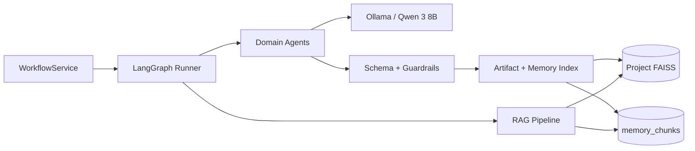

### 1.3 Responsibilities

| Responsibility | Owner Component | Out of Scope |
|----------------|-----------------|--------------|
| Module workflow orchestration | LangGraph graphs in `ai/graphs/` | HTTP routing (backend `app/api/v1/workflows.py`) |
| Domain reasoning and artifact drafting | Agents in `ai/agents/` | UI rendering (frontend) |
| Prompt assembly and versioning | `ai/prompts/` | User authentication |
| Retrieval over project + knowledge | `ai/rag/` | Generic chat history UX |
| Project memory lifecycle | `ai/memory/` | Billing, teams (v1) |
| Structured output validation | `ai/schemas/`, `ai/guardrails/` | Export file storage policy (backend `exporters/`) |
| Inference configuration | `ai/models/`, `ai/config/` | PostgreSQL schema design |
| Offline quality measurement | `ai/evaluation/` | Product analytics dashboards |
| AI-specific failure escalation | `ai/runtime/error_handler.py`, repair/reflection nodes | Non-AI HTTP error envelopes |

### 1.4 AI Philosophy

FoundrAI’s AI philosophy follows five tenets. These govern tradeoffs when implementation details are ambiguous.

1. **Artifacts over utterances.** Success is measured by durable, typed outputs (`validation_report`, `market_analysis`, etc.), not message count or conversational fluency.
2. **Ground before generate.** No domain agent invokes the LLM without prior retrieval from project memory and applicable knowledge categories (Section 8).
3. **Explicit structure.** All module outputs MUST conform to Pydantic schemas mirrored in API Reference §18. Free-form prose is a rendering concern (`content_markdown`), not the source of truth.
4. **Bounded agency.** Agents have narrow responsibilities declared in Section 5. Cross-domain reasoning is achieved through **artifact handoffs and RAG**, not omnibus prompts.
5. **Recoverable failure.** Schema, timeout, and inference failures follow a defined escalation ladder (Section 6, Section 11) before surfacing a failed `workflow_run` to the user.

The platform intentionally avoids open-ended chat as the primary interaction model (Product Spec §1.2).

### 1.5 Design Principles

| ID | Principle | Implication |
|----|-----------|-------------|
| DP-1 | **Single writer per artifact type** | One canonical `artifacts` row per `(project_id, artifact_type)`; agents upsert, never fork silently |
| DP-2 | **Deterministic orchestration, stochastic generation** | LangGraph edges are code-defined; LLM sampling is configurable but bounded by schema validation |
| DP-3 | **Idempotent memory indexing** | Re-index uses `content_hash` dedup (API Reference §3.10); PATCH triggers re-chunk, not duplicate chunks |
| DP-4 | **Prompts are code artifacts** | Versioned in-repo (`system.v1.md`), reviewed in PR, gated by eval (Section 10) |
| DP-5 | **Local-first inference** | v1 default model is `qwen3:8b` via Ollama; cloud routing is future (Section 14) |
| DP-6 | **Trace everything that affects output** | `agent_executions`, `workflow_steps`, retrieval chunk IDs in step metadata for audit |
| DP-7 | **Fail closed on schema** | Invalid JSON never persists; repair and reflection nodes exhaust retries before failure |
| DP-8 | **Untrusted user content** | `idea_brief` and user edits are data, not instructions (Section 11) |

### 1.6 System Context and Dependencies

The AI subsystem depends on services defined elsewhere:

| Dependency | Provided By | Failure Impact |
|------------|-------------|----------------|
| Workflow trigger and run records | Backend WorkflowService + Doc 03 §10.5 | Graph cannot start or persist |
| Project and artifact rows | PostgreSQL via repositories | `load_context` node empty |
| Ollama with `qwen3:8b` | Ollama daemon | All generation blocked; readiness 503 |
| Embedding model load | Sentence Transformers at API process start | RAG indexing and retrieve blocked |
| FAISS index directory | `FAISS_DATA_DIR` volume | Retrieve returns empty; generation ungrounded |
| Knowledge seed | `data/knowledge/` + `scripts/build_index.py` | Reduced grounding quality, not hard failure |

The AI layer exposes no public HTTP surface in v1. Backend imports `ai` as a Python package in-process (Product Spec §19, Implementation Guide §12).

### 1.7 Success Criteria

AI layer v1 is successful when the following measurable conditions hold.

#### 1.7.1 Functional

| ID | Criterion | Verification |
|----|-----------|--------------|
| SC-F1 | All eight module graphs compile and execute end-to-end | Integration test per `module_key` |
| SC-F2 | Each agent produces JSON validating against API Reference §18 schema | Pydantic + CI eval fixtures |
| SC-F3 | RAG retrieve runs before every `generation_node` invoke | Workflow step metadata contains `chunk_ids` |
| SC-F4 | Successful runs persist artifact, version, and memory chunks | DB assertions in integration tests |
| SC-F5 | Failed runs set `workflow_runs.status=failed` with `error_code` | No orphan artifacts without version |
| SC-F6 | Module dependency gates enforced before graph invoke | API returns 409; graph never starts |

#### 1.7.2 Quality

| ID | Criterion | Target |
|----|-----------|--------|
| SC-Q1 | Schema-valid outputs on golden eval set | ≥85% before repair; 100% after repair or fail |
| SC-Q2 | Faithfulness to retrieved context (LLM judge) | ≥4/5 average per agent |
| SC-Q3 | Hallucinated numeric claims in `investor_writer` | <5% on eval set |
| SC-Q4 | Module workflow p95 latency | <10 min (Product Spec NFR-PERF-003) |
| SC-Q5 | Agent execution p95 latency | <90s per invoke |

#### 1.7.3 Operational

| ID | Criterion | Target |
|----|-----------|--------|
| SC-O1 | Inference and agent logs correlate to `workflow_run_id` | 100% of production runs |
| SC-O2 | Prompt version recorded in `agent_executions.metadata_json` | Every execution |
| SC-O3 | Readiness probe fails when Ollama model missing | `/health/ready` checks `qwen3:8b` |

### 1.8 Document Map

Subsequent sections expand this summary without repeating product or API content.

| Section | Topic |
|---------|-------|
| 1 | Executive summary, philosophy, success criteria |
| 2 | Model architecture, inference pipeline, per-agent configuration |
| 3 | Prompt taxonomy, assembly, versioning, lifecycle |
| 4 | Multi-agent architecture, registration, execution pipeline |
| 5 | Individual agent behavioral specifications |
| 6 | LangGraph state, nodes, edges, checkpointing |
| 7 | Memory types, lifecycle, retrieval strategy |
| 8 | RAG, knowledge base, chunking, reranking |
| 9 | Output schemas, validation, repair, cross-agent linking |
| 10 | Evaluation dimensions, benchmarks, regression |
| 11 | Guardrails, injection defense, recovery |
| 12 | AI logging, tracing, metrics |
| 13 | Caching, token and latency optimization |
| 14 | Future AI capabilities and model routing |

### 1.9 Assumptions

| ID | Assumption |
|----|------------|
| AI-A1 | English-only prompts and outputs for v1 |
| AI-A2 | Single concurrent workflow run per module per project |
| AI-A3 | Qwen 3 8B sufficient for structured JSON at acceptable quality on dev hardware |
| AI-A4 | FAISS per-project indexes remain &lt;100k chunks in v1 |
| AI-A5 | No user-uploaded documents to knowledge base in v1 (curated seed only) |
| AI-A6 | Tool calling limited to `memory_search` and `calculator` in v1 |

### 1.10 Failure Modes (Executive Level)

Detailed handling in Sections 6, 9, and 11. Summary:

| Mode | User-visible outcome | AI layer response |
|------|---------------------|-------------------|
| Ollama down | Cannot start workflow | Pre-flight in readiness; no graph invoke |
| Timeout | Run failed | Retry → reduced context → fail |
| Invalid JSON | Run failed or repaired | Repair node → reflection → fail |
| Schema violation | Same | Business rule validation in guardrails |
| Empty retrieval | Degraded grounding | Proceed with brief-only + log warning |
| Dependency missing | 409 at API | Graph not invoked |

### 1.11 Future Improvements (Executive Level)

Section 14 details roadmap items. v1 defers: multi-model routing, web search tools, autonomous multi-module mega-graph, fine-tuning, MCP, voice/vision, conversation memory UX.

---

# Part II — LLM Layer

## 2. Model Architecture

### 2.1 Purpose

Define how FoundrAI selects, configures, and invokes language models for structured multi-agent workflows. v1 is Ollama-hosted open weights; routing extensibility is designed in without implementing cloud APIs.

### 2.2 Overview

All generation flows through `ai/models/ollama.py` wrapped by `ai/models/model_factory.py`. Agents never call HTTP directly. Configuration is declarative in `ai/config/agents.yaml` and `ai/config/models.yaml`.

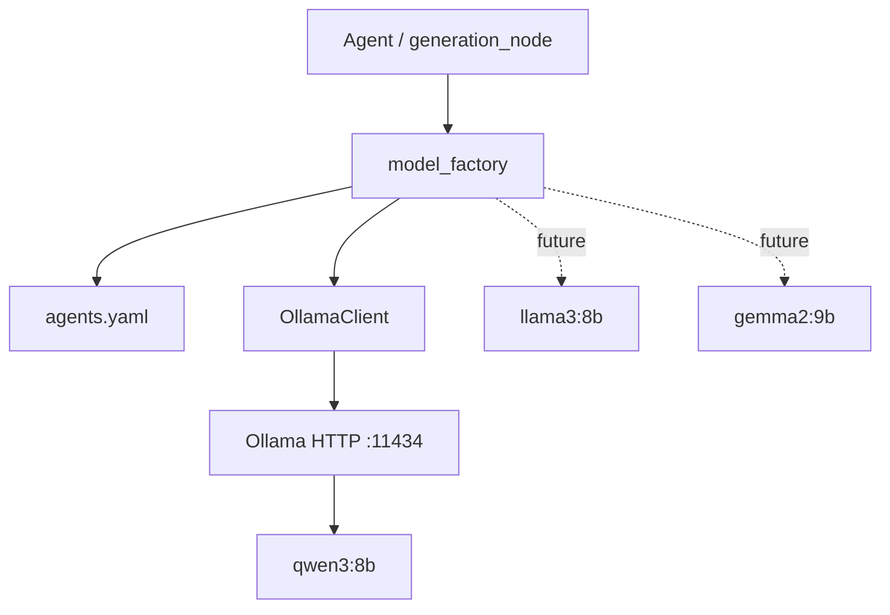

### 2.3 Supported Models

| Model ID | Provider | Status | Use Case |
|----------|----------|--------|----------|
| `qwen3:8b` | Ollama | **v1 primary** | All domain agents |
| `llama3:8b` | Ollama | Future fallback | Degraded retry path |
| `gemma2:9b` | Ollama | Future optional | Lightweight modules |

Embedding model (not LLM): `BAAI/bge-base-en-v1.5` via Sentence Transformers in `ai/rag/embeddings.py`.

### 2.4 Model Selection Strategy

| Decision Point | Rule |
|----------------|------|
| Default | `qwen3:8b` for all agents unless overridden in `agents.yaml` |
| Retry / fallback | On repeated timeout: same model with reduced context; if `FALLBACK_MODEL` env set, one attempt on fallback |
| Future routing | `model_factory.route(agent_id, task_type)` by complexity score (Section 14) |
| Eval runs | Pin model in eval config; compare against baseline manifest |

Selection is **per agent**, not per request user override in v1.

### 2.5 Model Configuration Parameters

| Parameter | Description | v1 Global Default |
|-----------|-------------|-------------------|
| **Temperature** | Sampling randomness | 0.3 structured; 0.2 financial |
| **Top P** | Nucleus sampling | 0.85–0.9 |
| **Top K** | Top-k sampling (Ollama) | 30–40 |
| **Context window** | Max input tokens | 8192 (12288 investor_writer) |
| **Max tokens** | Completion budget | 2048–4096 by agent |
| **Stop tokens** | Generation stop sequences | `[]` v1; optional `\n\nHuman` future |
| **Seed** | Reproducibility | 42 in dev/eval; omit in prod optional |

Per-agent matrix in Section 2.7.

### 2.6 Token Budget

Token allocation per invoke (approximate):

| Segment | Budget % | Notes |
|---------|----------|-------|
| System + developer prompts | 15–20% | Fixed per agent version |
| Retrieved context | 35–45% | Truncated oldest-first if overflow |
| Structured prior artifacts | 20–30% | JSON summaries from `load_context` |
| User template (brief, instructions) | 10–15% | |
| Reserved for completion | max_tokens config | Hard cap |

Overflow policy: drop lowest-scoring retrieval chunks first, then truncate artifact summaries, never truncate schema portion of developer prompt.

### 2.7 Per-Agent Inference Configuration

| Agent | Model | Temp | Top P | Top K | Context | Max Tokens |
|-------|-------|------|-------|-------|---------|------------|
| `idea_validator` | qwen3:8b | 0.30 | 0.90 | 40 | 8192 | 2048 |
| `market_researcher` | qwen3:8b | 0.35 | 0.90 | 40 | 8192 | 3072 |
| `business_modeler` | qwen3:8b | 0.30 | 0.85 | 40 | 8192 | 2560 |
| `product_strategist` | qwen3:8b | 0.35 | 0.90 | 40 | 8192 | 2560 |
| `technical_architect` | qwen3:8b | 0.25 | 0.85 | 30 | 8192 | 3072 |
| `financial_analyst` | qwen3:8b | 0.20 | 0.80 | 30 | 8192 | 4096 |
| `marketing_strategist` | qwen3:8b | 0.35 | 0.90 | 40 | 8192 | 2560 |
| `investor_writer` | qwen3:8b | 0.30 | 0.85 | 40 | 12288 | 4096 |
| `orchestrator` | qwen3:8b | 0.10 | 0.80 | 20 | 4096 | 256 |

**Retry overrides:** temperature −0.1, max_tokens ×0.75, top_k −10.

### 2.8 Inference Pipeline

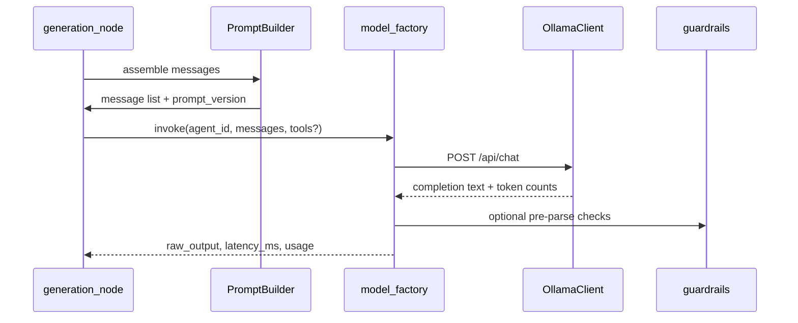

Steps:

1. **Assemble** — Section 3 prompt builder merges system, developer, context, user messages.
2. **Preflight** — Estimate tokens; trim context if over budget (Section 2.6).
3. **Invoke** — Sync HTTP to Ollama in v1; async wrapper for non-blocking worker future.
4. **Parse** — Strip markdown fences; `json.loads` with repair path (Section 9).
5. **Record** — Write `agent_executions` row with model, latency, token counts, prompt_version.

### 2.9 Streaming Strategy

| Mode | v1 | Behavior |
|------|-----|----------|
| Structured module runs | **Non-streaming** | Wait for full completion; validate JSON holistically |
| Future chat / clarifications | Streaming | SSE to frontend; not used in v1 module graphs |
| Progress UX | Workflow SSE | Step-level events from backend, not token stream |

Rationale: partial JSON is invalid for schema validation; streaming adds complexity without v1 user value.

### 2.10 Future Multi-Model Routing

`model_factory` will support:

| Route | Trigger |
|-------|---------|
| Local Qwen | Default |
| Local Llama | Primary timeout/fallback |
| Cloud API | Env `ENABLE_CLOUD_MODELS=true` + agent allowlist |
| Model by module | Investor/finance → larger context model |

Routing metadata stored in `agent_executions.model_name` and `metadata_json.routing_reason`.

### 2.11 Design Decisions

| Decision | Rationale |
|----------|-----------|
| Ollama not embedded | Process isolation; GPU on host |
| Single client singleton | Connection reuse |
| Seed in eval only | Prod diversity vs reproducibility tradeoff |
| No streaming v1 | Schema-first outputs |

### 2.12 Failure Modes

| Failure | Detection | Response |
|---------|-----------|----------|
| Connection refused | httpx error | Fail step; readiness down |
| Model not found | Ollama 404 | Fail readiness |
| Timeout | configurable per agent (default 120s) | Section 6 retry ladder |
| Context length exceeded | Ollama error / preflight | Trim and retry |

### 2.13 Acceptance Criteria

- All agents invoke through `model_factory` only.
- Config changes in YAML reflected without code change.
- `agent_executions` records model, latency, tokens for every invoke.

### 2.14 Future Improvements

vLLM sidecar, batch inference, speculative decoding, dynamic model unload/load based on queue depth.

---

# Part III — Prompt Engineering

## 3. Prompt Architecture

### 3.1 Purpose

Standardize how prompts are authored, composed, versioned, and audited across agents. Prompts are first-class repository artifacts, not inline strings.

### 3.2 Overview

Prompt assembly lives in `ai/prompts/` with a shared `PromptBuilder` in `ai/runtime/prompt_builder.py`. Each agent has a directory under `ai/prompts/agents/{agent_id}/`.

### 3.3 Prompt Types

| Type | File | Role |
|------|------|------|
| **System** | `system.v{N}.md` | Role, safety, output format, non-negotiable constraints |
| **Developer** | `developer.v{N}.md` | Schema field definitions, tool rules, module-specific logic |
| **User** | `user.v{N}.md` | Template with placeholders for runtime data |
| **Context** | Built at runtime | Retrieved chunks + artifact summaries (not a static file) |
| **Reflection** | `reflection.v{N}.md` | Post-generation self-critique instructions |
| **Repair** | `repair.v{N}.md` | Fix JSON/schema errors given prior output |
| **Validation** | `validation.v{N}.md` | Checklist for validation/reflection nodes |
| **Retry** | `retry.v{N}.md` | Shorter prompt after timeout/context trim |

### 3.4 Message Assembly Order

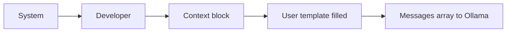

Ollama chat format:

| Role | Content source |
|------|----------------|
| `system` | system + developer concatenated |
| `user` | context + user template |

Alternative: developer as second system message if model supports; v1 uses concatenation.

### 3.5 Context Prompt Structure

Runtime context block format (deterministic):

```
## Project Context
- Name: {project_name}
- Industry: {industry}

## Idea Brief
{idea_brief_excerpt}

## Retrieved Memory
[1] ({source_type}/{artifact_type}) {chunk_text}
...

## Prior Artifacts Summary
{json_summaries}
```

Chunk ordering: descending retrieval score. Max chunks: 8 default.

### 3.6 Reflection and Repair Prompts

**Repair** receives: original messages, raw model output, parse/validation errors. Instruction: emit ONLY corrected JSON.

**Reflection** receives: parsed JSON + source chunk IDs. Instruction: answer yes/no rubric (faithfulness, completeness, unsupported claims). Failure triggers repair or fail.

### 3.7 Prompt Versioning

| Rule | Detail |
|------|--------|
| Naming | `{type}.v{major}.md`; minor edits bump major in v1 simplicity |
| Active version | `ai/prompts/agents/{id}/ACTIVE` file or `agents.yaml` pointer |
| Recording | `agent_executions.metadata_json.prompt_versions` map |
| Promotion | Requires eval pass (Section 10) + PR review |

### 3.8 Prompt Storage Layout

```
ai/prompts/
├── system/                 # Shared system fragments
├── developer/              # Shared schema fragments
├── agents/
│   ├── idea_validator/
│   │   ├── system.v1.md
│   │   ├── developer.v1.md
│   │   ├── user.v1.md
│   │   ├── repair.v1.md
│   │   └── reflection.v1.md
│   └── ...
├── repair/                 # Generic repair snippets
└── reflection/
```

### 3.9 Prompt Lifecycle

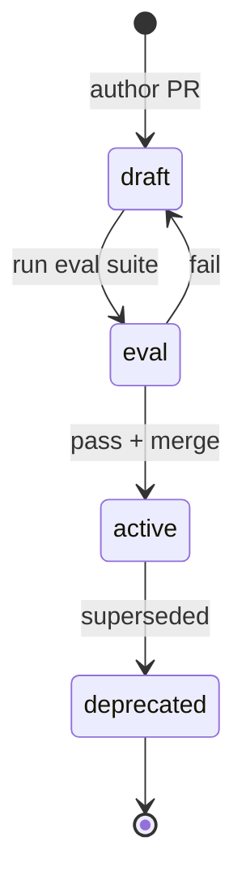

### 3.10 Design Decisions

| Decision | Rationale |
|----------|-----------|
| Markdown not Jinja2 heavy | Readable diffs; simple `{placeholder}` replace |
| Schema in developer prompt | Improves JSON adherence vs function-calling alone on 8B |
| Separate repair templates | Avoid polluting primary user prompt |

### 3.11 Failure Modes

| Mode | Mitigation |
|------|------------|
| Missing template file | Fail fast at graph compile |
| Placeholder unset | PromptBuilder raises before invoke |
| Prompt too long | Preflight trim context |

### 3.12 Acceptance Criteria

- Every agent has system, developer, user v1 files.
- Prompt version logged on every execution.
- Eval gates prompt promotion.

### 3.13 Future Improvements

Prompt registry UI, A/B experiments, automatic prompt compression, multilingual prompt packs.

---

# Part IV — Multi-Agent System

## 4. Agent Architecture

### 4.1 Purpose

Define how domain agents are structured, registered, invoked, and recovered within the FoundrAI AI layer.

### 4.2 Agent Philosophy

Agents are **specialized batch processors**, not conversational personas. Each agent:

- Accepts typed state from LangGraph.
- Calls LLM with assembled prompts and optional tools.
- Returns typed JSON for validation—never writes to DB directly (callback via node).

### 4.3 Overview

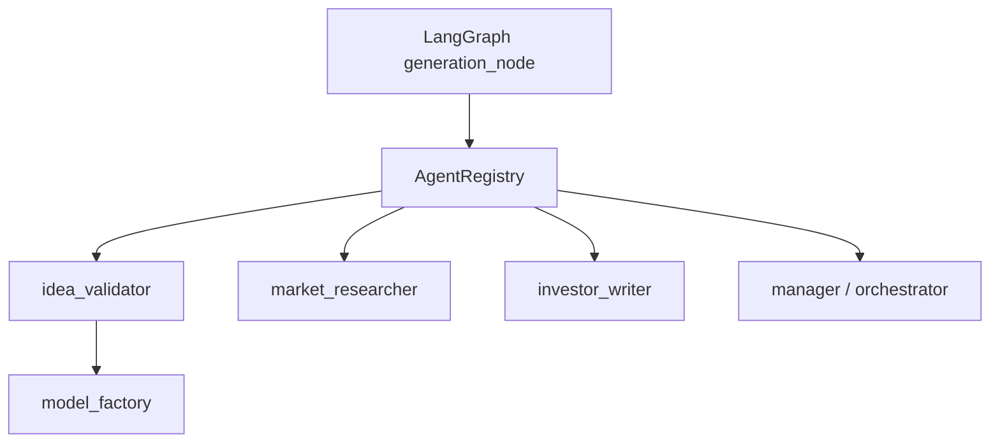

### 4.4 Agent Communication

v1: **indirect** via persisted artifacts and shared memory—not agent-to-agent messages.

| Mechanism | Description |
|-----------|-------------|
| Artifact handoff | Downstream `load_context` loads upstream JSON |
| RAG | Downstream retrieves upstream chunks from FAISS |
| Future | Manager agent delegates subtasks in single run (Section 14) |

No inter-agent chat bus in v1.

### 4.5 Agent Lifecycle

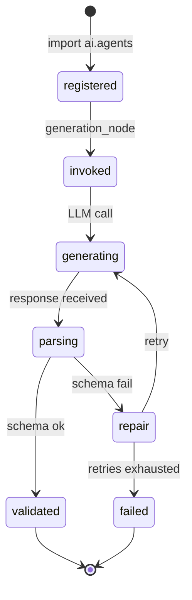

### 4.6 Agent Registration

`ai/agents/registry.py`:

| Field | Source |
|-------|--------|
| `agent_id` | Directory name |
| `module_key` | `agents.yaml` |
| `artifact_type` | Schema mapping |
| `handler` | Callable or LangChain runnable |
| `tools` | List of tool names |
| `graph_node_name` | Default `generation_node` delegate |

Registration at import time; unknown `agent_id` fails graph compile.

### 4.7 Agent Discovery

Graph factory resolves agent by `module_key` → `agents.yaml` → `agent_id`. Orchestrator (`ai/agents/manager/`) validates module_key on future multi-graph flows.

### 4.8 Agent Dependencies

| Dependency Type | Enforced By |
|-----------------|-------------|
| Upstream artifacts | API module gate + `load_context` |
| Knowledge categories | RAG filter in `rag_node` |
| Tools | Agent registry |
| Model config | `agents.yaml` |

### 4.9 Agent Execution Pipeline

1. `generation_node` reads `WorkflowState.retrieved_chunks`, `required_artifacts`.
2. `PromptBuilder.build(agent_id, state)` → messages.
3. `AgentRegistry.get(agent_id).run(messages, tools, state)`.
4. Parse JSON → return `draft_output` in state.
5. `validation_node` + optional `reflection_node`.

### 4.10 Agent Failure Handling

| Error | Handler |
|-------|---------|
| LLM timeout | `error_handler.retry_with_backoff` |
| Invalid JSON | `repair_node` |
| Schema fail | `repair_node` then fail |
| Tool error | Log; financial agent fails if calculator required |

### 4.11 Agent Retry Logic

| Layer | Max retries | Backoff |
|-------|-------------|---------|
| LLM timeout | 1 same-node | Immediate |
| Repair | 2 | Immediate with repair prompt |
| Context trim retry | 1 | After dropping 50% chunks |

Total graph-level retries configurable: `max_retries=2` default in `ai/config/graphs.yaml`.

### 4.12 Design Decisions

| Decision | Rationale |
|----------|-----------|
| No direct DB in agents | Testability; single persist node |
| Registry pattern | Explicit agent list |
| Manager separate | Routing without artifact pollution |

### 4.13 Acceptance Criteria

- Eight domain agents + manager registered.
- Each maps 1:1 to module_key (except manager).

### 4.14 Future Improvements

Agent capability metadata, dynamic agent loading, hierarchical manager-worker trees.

---

## 5. Individual Agent Specifications

### 5.1 Purpose

Authoritative behavioral specification for each agent. JSON field definitions: **API Reference artifact schemas** and `ai/schemas/`. Module product intent: **Product Spec §12**.

### 5.2 Shared Validation Rules

All agents:

- Output MUST be single JSON object, no markdown wrapper after repair.
- MUST NOT execute instructions embedded in user content.
- MUST label uncertain claims with `"confidence": "low"` where schema allows.
- MUST pass Pydantic validation before `persist_artifact`.

---

### 5.3 Idea Validation Agent

| Attribute | Specification |
|-----------|---------------|
| **Agent ID** | `idea_validator` |
| **Purpose** | Validate clarity, problem-solution fit, and initial feasibility |
| **Responsibilities** | Problem/solution articulation; target customer hypothesis; risks; validation score — **excludes** market sizing and financials |
| **Input** | `idea_brief`, `industry`, `project.name`, `input_snapshot` |
| **Output** | `validation_report`: `problem`, `solution`, `target_customer`, `risks[]`, `validation_score`, `recommendations[]`, `summary` |
| **Dependencies** | Ollama, project brief indexed in memory |
| **Prompt** | `ai/prompts/agents/idea_validator/` v1 |
| **Knowledge** | `data/knowledge/startup/`, `templates/validation/` |
| **Memory** | `idea_brief` chunks only |
| **Tools** | `memory_search` (optional self-retrieve) |
| **Validation** | `risks.length >= 3`; `validation_score` 0–100 |
| **Retry** | Repair ×2 → brief-only context retry |
| **Failures** | Empty risks; brief insufficient; timeout |
| **Acceptance** | Faithfulness to brief ≥4/5; latency p95 <120s |
| **Performance** | max_tokens 2048; temp 0.3 |
| **Example output (shape)** | `{ "problem": "...", "solution": "...", "target_customer": {...}, "risks": [{...}], "validation_score": 72, "recommendations": [...], "summary": "..." }` |

---

### 5.4 Market Research Agent

| Attribute | Specification |
|-----------|---------------|
| **Agent ID** | `market_researcher` |
| **Purpose** | Market landscape, TAM/SAM/SOM, segments, competitors |
| **Responsibilities** | Size opportunity; map competition; trends — **excludes** pricing and revenue projections |
| **Input** | `validation_report`, `idea_brief`, RAG chunks |
| **Output** | `market_analysis`: `tam`, `sam`, `som`, `segments[]`, `competitors[]`, `trends[]`, `summary` |
| **Dependencies** | `validation_report` artifact |
| **Knowledge** | `marketing/`, `startup/market_sizing/`, `case_studies/` |
| **Memory** | Prioritize validation + brief chunks |
| **Tools** | `memory_search` |
| **Validation** | `competitors.length >= 3`; TAM/SAM/SOM include units |
| **Retry** | Reduce to validation-only context |
| **Failures** | Missing upstream artifact; fabricated competitors without confidence flag |
| **Acceptance** | Retrieval precision@8 ≥0.7 on eval |
| **Example output (shape)** | `{ "tam": {"value": "...", "unit": "USD"}, "competitors": [{"name": "...", "strengths": "..."}], ... }` |

---

### 5.5 Business Model Agent

| Attribute | Specification |
|-----------|---------------|
| **Agent ID** | `business_modeler` |
| **Purpose** | Nine-block business model canvas |
| **Responsibilities** | Value prop, segments, channels, revenue, costs — **excludes** product features and tech |
| **Input** | `validation_report`, `market_analysis`, RAG |
| **Output** | `business_model_canvas`: nine canvas blocks + `summary` |
| **Dependencies** | validation + market artifacts |
| **Knowledge** | `startup/business_model/`, `templates/canvas/` |
| **Memory** | Boost market + validation |
| **Tools** | `memory_search` |
| **Validation** | All blocks non-empty; reflection checks revenue/value alignment |
| **Retry** | Reflection → repair |
| **Failures** | Empty block; internal contradiction |
| **Acceptance** | Cross-block consistency ≥80% eval pass |
| **Example output (shape)** | `{ "value_proposition": "...", "customer_segments": [...], "revenue_streams": [...], ... }` |

---

### 5.6 Product Strategist Agent

| Attribute | Specification |
|-----------|---------------|
| **Agent ID** | `product_strategist` |
| **Purpose** | MVP roadmap with phased features and metrics |
| **Input** | `business_model_canvas`, RAG |
| **Output** | `product_roadmap`: `vision`, `phases[]`, `success_metrics[]`, `summary` |
| **Dependencies** | business model artifact |
| **Knowledge** | `product/`, `templates/roadmap/` |
| **Validation** | ≥2 phases; ≥3 features per phase |
| **Retry** | Repair with explicit phase count |
| **Acceptance** | Metrics reference canvas revenue drivers |
| **Example output (shape)** | `{ "phases": [{"name": "MVP", "features": [{...}]}], ... }` |

---

### 5.7 Technical Architect Agent

| Attribute | Specification |
|-----------|---------------|
| **Agent ID** | `technical_architect` |
| **Purpose** | System architecture aligned to product scope |
| **Input** | `product_roadmap`, RAG |
| **Output** | `architecture_doc`: `overview`, `components[]`, `data_flows[]`, `recommended_stack`, `security`, `scalability`, `summary` |
| **Dependencies** | product roadmap artifact |
| **Knowledge** | `software/`, `architecture/` |
| **Validation** | ≥3 components; security section required |
| **Retry** | Roadmap-only context; temp 0.2 |
| **Acceptance** | Stack proportionate to MVP scope |
| **Example output (shape)** | `{ "components": [{"name": "API", "role": "..."}], "recommended_stack": {...}, ... }` |

---

### 5.8 Financial Analyst Agent

| Attribute | Specification |
|-----------|---------------|
| **Agent ID** | `financial_analyst` |
| **Purpose** | 12-month financial model with assumptions |
| **Input** | `business_model_canvas`, `product_roadmap`, RAG |
| **Output** | `financial_model`: `assumptions[]`, `revenue_drivers[]`, `cost_buckets[]`, `monthly_projections[]`, `unit_economics`, `summary` |
| **Dependencies** | business model + product roadmap |
| **Knowledge** | `finance/`, `templates/financial/` |
| **Tools** | `memory_search`, **`calculator`** (required for totals) |
| **Validation** | 12 monthly rows; ≥5 assumptions; calculator consistency |
| **Retry** | Force tool calls; simplify on second retry |
| **Failures** | Arithmetic mismatch >1% |
| **Acceptance** | Projections traceable to assumptions |
| **Example output (shape)** | `{ "monthly_projections": [{"month": 1, "revenue": 0, "costs": 5000}], ... }` |

---

### 5.9 Marketing Strategist Agent

| Attribute | Specification |
|-----------|---------------|
| **Agent ID** | `marketing_strategist` |
| **Purpose** | ICP, positioning, channels, launch plan |
| **Input** | `business_model_canvas`, `product_roadmap`, RAG |
| **Output** | `marketing_plan`: `icp`, `positioning`, `messaging`, `channels[]`, `launch_checklist[]`, `timeline`, `summary` |
| **Dependencies** | business model + product roadmap |
| **Knowledge** | `marketing/`, `case_studies/gtm/` |
| **Validation** | ≥3 channels; checklist ≥5 items |
| **Acceptance** | ICP aligns with canvas segments |
| **Example output (shape)** | `{ "channels": [{"name": "Content SEO", "rationale": "..."}], ... }` |

---

### 5.10 Investor Writer Agent

| Attribute | Specification |
|-----------|---------------|
| **Agent ID** | `investor_writer` |
| **Purpose** | Investor deck outline synthesizing prior artifacts |
| **Input** | All artifact types (structured + RAG) |
| **Output** | `investor_deck_outline`: `slides[]`, `narrative_arc`, `summary` |
| **Dependencies** | All prior modules recommended |
| **Knowledge** | `pitch_decks/`, `templates/deck/` |
| **Validation** | ≥10 slides; required slide types; no unsupported stats |
| **Retry** | Reflection vs sources → repair |
| **Failures** | Hallucinated numbers; missing ask slide |
| **Acceptance** | Faithfulness ≥4/5; hallucination <5% |
| **Example output (shape)** | `{ "slides": [{"number": 1, "title": "Problem", "bullets": [...]}], ... }` |

---

### 5.11 Agent Manager (`orchestrator`)

| Attribute | Specification |
|-----------|---------------|
| **Agent ID** | `orchestrator` |
| **Purpose** | Resolve module_key → graph; validate preconditions |
| **Responsibilities** | Routing only — **no artifact** |
| **Input** | `module_key`, module status snapshot |
| **Output** | `{ "graph_id": "...", "agent_id": "..." }` internal |
| **Dependencies** | AgentRegistry, GraphFactory |
| **Tools** | `route_module` |
| **Failures** | Unknown module; internal misconfig |
| **Acceptance** | 100% routing test pass |

---

# Part V — LangGraph

## 6. LangGraph Design

### 6.1 Purpose

Define graph topology, state schema, nodes, edges, and persistence for module workflows.

### 6.2 Graph Architecture

v1: **one compiled graph per `module_key`**. Graphs share node implementations from `ai/nodes/`.

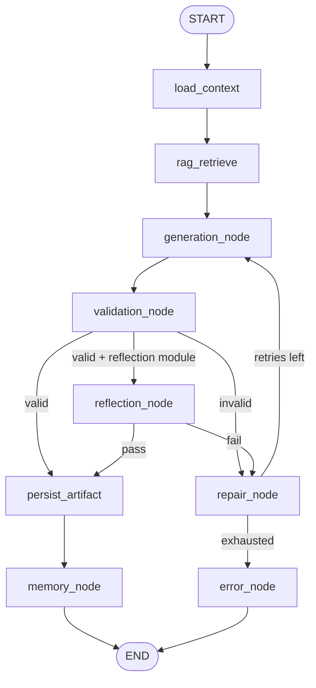

### 6.3 State Definition

`WorkflowState` in `ai/graphs/state.py`:

| Field | Type | Mutable By |
|-------|------|------------|
| `project_id` | UUID | load_context |
| `module_key` | str | — |
| `run_id` | UUID | — |
| `user_id` | UUID | — |
| `input_snapshot` | dict | — |
| `project_context` | dict | load_context |
| `required_artifacts` | dict[str, dict] | load_context |
| `retrieved_chunks` | list[RetrievedChunk] | rag_retrieve |
| `messages` | list | generation_node |
| `raw_output` | str | generation_node |
| `draft_output` | dict | generation_node, repair_node |
| `validation_errors` | list[str] | validation_node |
| `retry_count` | int | repair_node |
| `reflection_passed` | bool | reflection_node |
| `artifact_id` | UUID | persist_artifact |
| `errors` | list[str] | any fail |

LangGraph `TypedDict` with reducers for append-only fields (`errors`, `validation_errors`).

### 6.4 Node Responsibilities

| Node | File | Responsibility |
|------|------|----------------|
| `load_context` | `context_loader.py` | Fetch project + required artifacts from DB via callback |
| `rag_retrieve` | `rag_node.py` | Build query; call retrieval pipeline; fill `retrieved_chunks` |
| `generation_node` | `generation_node.py` | Prompt build + agent invoke |
| `validation_node` | `validation_node.py` | Pydantic + business rules |
| `reflection_node` | `reflection_node.py` | Optional quality gate |
| `repair_node` | `repair_node.py` | Increment retry; assemble repair prompt |
| `persist_artifact` | `export_node.py` | Callback to ArtifactService |
| `memory_node` | `memory_node.py` | Chunk + embed + FAISS upsert |
| `error_node` | `error_node.py` | Set failed status on run |

### 6.5 Edges and Conditional Routing

| Condition | Route |
|-----------|-------|
| `validation_errors` empty | → reflection (if enabled) or persist |
| `validation_errors` non-empty && retry_count < max | → repair |
| else | → error |
| `reflection_passed == False` && retries left | → repair |
| `repair_node` complete | → generation |

Routing functions in `ai/graphs/routing.py` as pure predicates on state.

### 6.6 Sequential vs Parallel Execution

| Pattern | v1 Usage |
|---------|----------|
| **Sequential** | All nodes in standard pipeline |
| **Parallel** | Not used v1 |
| **Future** | Parallel retrieval (project + knowledge indexes); fan-out sub-agents under manager |

### 6.7 Retry, Reflection, Repair, Validation Nodes

Documented in Sections 3, 4, 9. Max repair attempts: 2. Reflection enabled for: `business_modeler`, `investor_writer`.

### 6.8 Graph Termination

| Terminal | Condition |
|----------|-----------|
| Success END | memory_node completes |
| Fail END | error_node after exhausted retries or unrecoverable LLM error |

Backend sets `workflow_runs.status` and emits SSE (Doc 03 §17).

### 6.9 Error Handling in Graph

Central `ai/runtime/error_handler.py` classifies exceptions → retryable vs terminal. Non-retryable: config errors, missing agent registration.

### 6.10 Checkpointing

| v1 | Future |
|----|--------|
| DB step rows at node boundaries | LangGraph PostgresSaver |
| In-memory state during run | Resume long-running graphs |

### 6.11 Graph Persistence

`GraphFactory` in `ai/graphs/graph_factory.py` caches compiled graphs. Module mapping:

| module_key | Graph file |
|------------|------------|
| `idea_validation` | `validation_graph.py` |
| `market_research` | `market_research_graph.py` |
| ... | ... |
| `investor_documentation` | `investor_graph.py` |

### 6.12 Design Decisions

Compile once at startup; shared nodes reduce drift across modules.

### 6.13 Acceptance Criteria

- Each module graph executes independently.
- Step sequence persisted matches node order.
- Failed runs never reach persist without valid draft.

### 6.14 Future Improvements

Mega-graph orchestrating full startup lifecycle; parallel agent branches; human-in-the-loop interrupt nodes.

---

# Part VI — Memory System

## 7. Memory Architecture

### 7.1 Purpose

Define how FoundrAI stores, updates, retrieves, and compresses information across workflow runs.

### 7.2 Memory Types

| Type | Scope | Storage | TTL |
|------|-------|---------|-----|
| **Short-term** | Single graph run | WorkflowState | Run duration |
| **Long-term / Project** | Project lifetime | PostgreSQL + FAISS | Until project deleted |
| **Artifact** | Per artifact version | memory_chunks `source_type=artifact` | Until re-index |
| **Conversation** | User clarifications | Future table | v1 unused |
| **Knowledge** | Global curated | knowledge_documents + copied chunks | Versioned by seed |

### 7.3 Overview

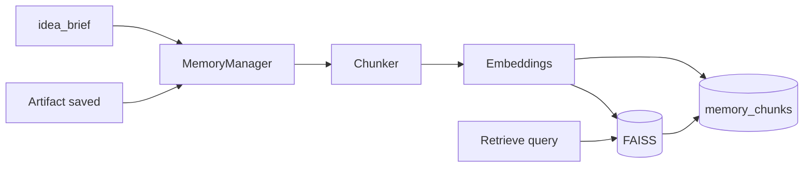

### 7.4 Memory Lifecycle

| Event | Action |
|-------|--------|
| Project create | Index `idea_brief` |
| Workflow success | Index new/updated artifact |
| User PATCH artifact | Delete old chunks by source_id; re-chunk |
| Brief PATCH | Re-chunk brief; invalidate stale brief chunks |
| Project delete | Remove FAISS file + cascade DB |

### 7.5 Memory Update Rules

- **Append-only artifacts** at version level; current artifact chunks replaced on re-index.
- Dedup via `content_hash` (Doc 03 §3.10).
- Never index raw LLM failures or invalid JSON.

### 7.6 Memory Compression and Summarization

| v1 | v1.1+ |
|----|-------|
| Full chunk store | `summarizer.py` for artifacts >N tokens |
| Truncate at retrieval | Hierarchical summaries in metadata |

### 7.7 Memory Expiration

No TTL on project memory in v1. Soft-deleted projects stop retrieval via access control, not chunk purge until hard delete.

### 7.8 Memory Retrieval Strategy

Used by `rag_node` and `memory_search` tool:

1. Embed query (same model as index).
2. FAISS top_k × 2 candidates.
3. Filter by `project_id`, optional `module_key`, `source_types`.
4. Optional rerank (Section 8).
5. Return top_k with scores and metadata.

### 7.9 Design Decisions

Per-project FAISS isolates tenants without index filtering complexity at scale v1.

### 7.10 Failure Modes

| Mode | Response |
|------|----------|
| Empty index | Log warning; proceed with brief in prompt |
| Re-index failure | Fail memory_node; artifact still persisted (manual re-index job) |
| FAISS corrupt | Rebuild from memory_chunks metadata |

### 7.11 Acceptance Criteria

- Chunks exist for brief after project create.
- Artifact index updated within same run as persist.
- Search returns only owning project chunks.

### 7.12 Future Improvements

Conversation memory, user preference memory, cross-project anonymized benchmarks (opt-in).

---

# Part VII — RAG

## 8. Retrieval-Augmented Generation

### 8.1 Purpose

Ground agent generation in project facts and curated startup knowledge.

### 8.2 Knowledge Base Structure

```
data/knowledge/
├── startup/
├── finance/
├── marketing/
├── product/
├── software/
├── architecture/
├── pitch_decks/
├── case_studies/
├── templates/
├── legal/
└── books/
```

Ingested via `scripts/build_index.py` → `knowledge_documents` + embeddings.

### 8.3 Knowledge Categories

| Category | Used By Agents |
|----------|----------------|
| startup | idea_validator, business_modeler |
| finance | financial_analyst |
| marketing | market_researcher, marketing_strategist |
| product | product_strategist |
| software, architecture | technical_architect |
| pitch_decks | investor_writer |
| templates | All (format guidance) |
| case_studies | market, marketing |
| legal | investor (disclaimer-level) |
| books | General grounding (low weight) |

### 8.4 Chunking Strategy

| Parameter | Value |
|-----------|-------|
| Chunk size | 512 tokens |
| Overlap | 50 tokens |
| Splitter | Paragraph-aware; JSON flattened to lines |

### 8.5 Metadata

| Field | Purpose |
|-------|---------|
| `source_type` | artifact \| project_field \| knowledge |
| `source_id` | UUID reference |
| `module_key` | Provenance filter |
| `category` | Knowledge folder |
| `title`, `document_slug` | Attribution |
| `artifact_type` | Boost relevance |

### 8.6 Embeddings and Indexing

- Model: `BAAI/bge-base-en-v1.5`, L2-normalized.
- Index: FAISS `IndexFlatIP` per project.
- Knowledge chunks copied into project index on first workflow (v1 design).

Pipeline: `ai/rag/pipeline.py` orchestrates chunk → embed → upsert.

### 8.7 Retrieval

| Setting | Default |
|---------|---------|
| top_k | 8 |
| pre_filter | project_id mandatory |
| score threshold | none v1; 0.3 optional v1.1 |

Query template per module in `ai/config/retrieval.yaml`.

### 8.8 Reranking

`ai/rag/reranker.py` — optional v1.1. Retrieve 20 → cross-encoder rerank → top 8.

### 8.9 Context Assembly

Ordered block: project facts → artifact chunks (score desc) → knowledge chunks. Each line prefixed with `[source_id:artifact_type]` for reflection audits.

### 8.10 Source Attribution

Store `chunk_ids` in `workflow_steps.metadata_json` for traceability. Future UI citations.

### 8.11 Knowledge Updates

Admin re-run `build_index.py`; bump seed version; optional background re-index all projects (future).

### 8.12 Design Decisions

Separate knowledge from project memory in metadata but unified FAISS per project for simple retrieval API.

### 8.13 Failure Modes

| Mode | Response |
|------|----------|
| Embedding model unload | Fail readiness |
| Zero retrieval results | Degraded generation + log |
| Poisoned seed file | CI hash verification on knowledge |

### 8.14 Acceptance Criteria

- Retrieve executes before every generation_node.
- Chunk IDs logged on workflow step.
- Knowledge categories reachable per agent mapping.

### 8.15 Future Improvements

Hybrid BM25 + vector, query rewriting, per-category indexes, user uploads.

---

# Part VIII — Output System

## 9. Output Architecture

### 9.1 Purpose

Ensure all agent outputs are structured, valid, versioned, and linkable across modules.

### 9.2 Output Schemas

Canonical schemas in `ai/schemas/{artifact_type}.py` (Pydantic). Mirror for API consumers in Doc 03. Each artifact type maps 1:1 to module primary output (Product Spec §12.9).

### 9.3 Structured JSON

Primary source of truth. Fields use `snake_case`. Nested objects preferred over long strings where downstream agents consume programmatically.

### 9.4 Markdown Generation

`content_markdown` generated post-validation by template renderers in `ai/tools/markdown.py` from JSON—optional for persist, recommended for UI/export.

### 9.5 Validation Pipeline

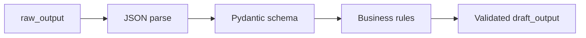

Business rules examples: array min lengths, score ranges, financial row count.

### 9.6 Schema Enforcement

Fail closed. Invalid state never reaches `persist_artifact`.

### 9.7 Repair

Repair prompt includes: schema excerpt, error list, invalid output. Max 2 attempts.

### 9.8 Output Versioning

Backend creates `artifact_versions` row (Doc 03). AI layer supplies `change_summary: "AI generation"` or includes `prompt_version` in metadata.

### 9.9 Document Linking and Cross-Agent References

`required_artifacts` in state carries upstream JSON snapshots. Downstream prompts reference explicit artifact types—not free-text prior chats. Investor agent must include `source_artifacts: string[]` field listing types used (schema extension).

### 9.10 Design Decisions

JSON-first enables export pipeline and eval scripts without re-parsing markdown.

### 9.11 Failure Modes

| Mode | Outcome |
|------|---------|
| Repair exhausted | `SCHEMA_VALIDATION_FAILED` on run |
| Markdown render fail | Persist JSON only; log warning |

### 9.12 Acceptance Criteria

100% persisted artifacts pass Pydantic on write path.

### 9.13 Future Improvements

JSON schema `$ref` registry, automated cross-artifact consistency graph.

---

# Part IX — Evaluation

## 10. AI Evaluation

### 10.1 Purpose

Measure and regress AI quality systematically—not ad hoc manual review.

### 10.2 Evaluation Dimensions

| Dimension | Method | Target |
|-----------|--------|--------|
| **Faithfulness** | LLM judge vs retrieved chunks | ≥4/5 |
| **Relevance** | Rubric per module | ≥4/5 |
| **Completeness** | Schema + rule checks | 100% post-repair |
| **Consistency** | Cross-field validators | ≥80% business_model |
| **Hallucination** | Numeric audit investor agent | <5% |
| **Latency** | `agent_executions.latency_ms` | p95 <90s |
| **Cost** | Token counts × local cost model | Track trend |
| **Token usage** | prompt + completion tokens | Budget alerts future |

### 10.3 Success Metrics

Align with Product Spec §33.3 and Section 1.7.

### 10.4 Regression Testing

| Asset | Location |
|-------|----------|
| Golden inputs | `ai/tests/evals/fixtures/{agent_id}/` |
| Expected schema | Pydantic validate |
| Expected keys | YAML assertions |
| Judge prompts | `ai/evaluation/judges/` |

CI on PR touching `ai/prompts/` or `ai/agents/`: run full eval suite.

### 10.5 Benchmark Strategy

| Phase | Scope |
|-------|-------|
| v1 | 5–10 fixtures per agent; schema + key rules |
| v1.1 | +50 synthetic projects; faithfulness judges |
| v2 | Public benchmark subset for marketing |

`ai/evaluation/benchmark.py` orchestrates runs; results JSON artifact in CI.

### 10.6 Design Decisions

Eval uses same Ollama model as prod for comparability; seed fixed.

### 10.7 Acceptance Criteria

Eval suite green before release tag; no prompt promotion without eval.

### 10.8 Future Improvements

Human eval portal, online A/B, automatic regression alerts on faithfulness drop.

---

# Part X — Safety

## 11. AI Guardrails

### 11.1 Purpose

Mitigate AI-specific threats without blocking legitimate startup planning use cases.

### 11.2 Overview

Guardrails in `ai/guardrails/` run at pre-inference, post-inference, and persist boundaries.

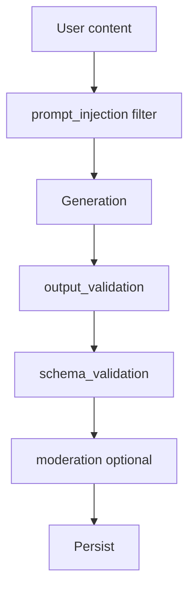

### 11.3 Prompt Injection Protection

- System prompts declare user content untrusted.
- `prompt_injection.py` flags patterns: "ignore previous", "system:", excessive role-play escapes.
- Flagged content wrapped in delimiters and labeled `UNTRUSTED_USER_DATA`.

### 11.4 Context Poisoning

User-edited artifacts could mislead downstream agents. Mitigations:

- Reflection on investor/financial outputs.
- Provenance tags on retrieval.
- Numeric cross-check against source artifacts.

### 11.5 Knowledge Poisoning

- Curated seed only v1; CI SHA256 on `data/knowledge/**`.
- Admin-only ingest future.

### 11.6 Output Filtering

`moderation.py` optional categories: hate, violence, illegal instructions. Fail persist on hard hits.

### 11.7 Schema Validation

`schema_validation.py` wraps Pydantic; see Section 9.

### 11.8 Rate Limiting

Workflow trigger rate limits enforced at API (Doc 03). AI layer respects single concurrent module run.

### 11.9 Unsafe Outputs

Financial/legal disclaimers injected in investor and financial markdown templates—not legal advice.

### 11.10 Recovery Strategy

| Threat | Recovery |
|--------|----------|
| Injection detected | Sanitize + log; do not abort unless severe |
| Poisoned output | Fail validation; user manual edit |
| Moderation hit | Fail run; clear error |

### 11.11 Acceptance Criteria

Injection test suite passes; no raw user instructions in system role merge.

### 11.12 Future Improvements

Dedicated security model, adversarial eval set, tenant isolation audits.

---

# Part XI — Observability

## 12. AI Logging

### 12.1 Purpose

Enable debugging, auditing, and performance tuning of AI workflows.

### 12.2 Log Categories

| Category | Fields | Storage |
|----------|--------|---------|
| **Inference** | model, latency_ms, tokens, run_id | stdout + agent_executions |
| **Agent** | agent_id, status, retry_count, prompt_version | agent_executions |
| **Prompt** | versions, token estimate | metadata_json (not full text prod) |
| **Workflow** | step_key, status, duration | workflow_steps |
| **Memory** | chunks_written, index_size | step metadata |
| **Retrieval** | query_hash, chunk_ids, scores | workflow_steps.metadata_json |

### 12.3 Performance Metrics

Export via `ai/telemetry/` to Prometheus future: `foundrai_agent_latency_seconds`, `foundrai_rag_retrieval_seconds`, `foundrai_repair_total`.

### 12.4 Tracing

Correlation ID = `workflow_run_id` propagated through all AI log lines and DB rows.

Optional OpenTelemetry spans around Ollama HTTP v1.1.

### 12.5 Monitoring

Alerts: Ollama down, eval faithfulness drop, repair rate >30%, p95 latency SLO breach.

### 12.6 Design Decisions

No full prompt logging in production; debug flag `LOG_PROMPTS=true` dev only.

### 12.7 Acceptance Criteria

Every failed run traceable to agent_id and error classification.

### 12.8 Future Improvements

Grafana dashboards, cost attribution per project.

---

# Part XII — Optimization

## 13. AI Optimization

### 13.1 Purpose

Reduce latency and compute cost while preserving output quality.

### 13.2 Caching Strategy

| Cache | Key | TTL |
|-------|-----|-----|
| **Embedding cache** | content_hash | Indefinite in-process LRU |
| **Prompt cache** | hash(system+developer version) | Until deploy |
| **Response cache** | Not v1 | Future for identical inputs |

`data/cache/embeddings/` optional disk cache for knowledge chunks.

### 13.3 Parallelization

| v1 | Future |
|----|--------|
| Sequential graph | Parallel embed batch on re-index |
| | Parallel retrieval sources |

### 13.4 Latency Optimization

- Trim context preflight (Section 2.6).
- Single Ollama client with keep-alive.
- Avoid reflection on fast modules (idea_validator).

### 13.5 Token Optimization

- JSON summaries of large artifacts in context, not full JSON.
- Lower max_tokens on retry.
- Compress retrieval snippets to 400 chars in context block.

### 13.6 Future Improvements

Speculative decoding, quantized models, distillation for validation-only passes.

### 13.7 Acceptance Criteria

p95 module workflow within NFR budget on reference hardware.

---

# Part XIII — Future AI Roadmap

## 14. Future AI Features

### 14.1 Purpose

Sequence AI capability evolution without blocking v1 delivery.

### 14.2 Roadmap

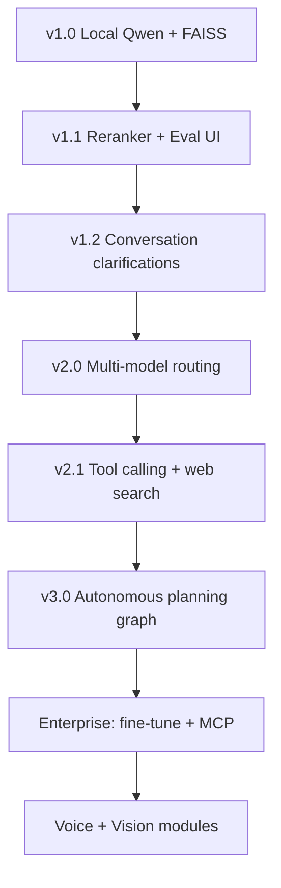

### 14.3 Feature Matrix

| Feature | Description | Phase |
|---------|-------------|-------|
| **Multiple models** | Llama, Gemma, cloud APIs | v2.0 |
| **Model routing** | Complexity-based selection | v2.0 |
| **Tool calling** | Web search, CRM, calendar | v2.1 |
| **Web search** | Live market data with citations | v2.1 |
| **Code generation** | MVP scaffold from architecture doc | v2.1 |
| **Voice** | Brief capture, deck rehearsal | v3.2 |
| **Vision** | Upload pitch deck PDF for critique | v3.2 |
| **Autonomous planning** | Manager runs multi-module plan | v3.0 |
| **Fine-tuning** | Domain adapters on anonymized artifacts | Enterprise |
| **MCP support** | External tool protocol | Enterprise |
| **Enterprise AI** | Dedicated models, VPC, audit exports | v3.0+ |

### 14.4 Design Constraints for Future Work

- Preserve artifact schema contracts across model changes.
- Routing must log `model_name` + reason.
- New tools must pass guardrails eval before enable.

### 14.5 Acceptance Criteria for v1 Baseline

Future features MUST NOT regress v1 eval suite when disabled by config.

---

*End of Document 4 — FoundrAI AI System Design Specification*
